# 🏫 NYSDOE: Agentic AI for School District Automation

## Table of Contents

- [Use Case Description](#use-case-description)
- [Pre-requisites](#pre-requisites)
  - [Step A: Set up the NYC Location API connection](#step-a-set-up-the-nyc-location-api-connection)
  - [Step B: Import the necessary tools (NYC Location API tool, Security API tool, and Facilities API tool)](#step-b-import-the-necessary-tools-nyc-location-api-tool-security-api-tool-and-facilities-api-tool)
- [Part 1 — Building the Operations Use Case - "Automated District Relocation"](#part-1--building-the-operations-use-case---automated-district-relocation)
  - [The flow we are building](#the-flow-we-are-building)
  - [Step 1: Create the Operations Agent](#step-1-create-the-operations-agent)
  - [Step 2: Create the Operations Workflow](#step-2-create-the-operations-workflow)
  - [Step 3: Test the Operations Agent](#step-3-test-the-operations-agent)
- [Part 2 — Building the Emergency Use Case - "District-Wide Threat Response"](#part-2--building-the-emergency-use-case---district-wide-threat-response)
  - [The flow we are building](#the-flow-we-are-building-1)
  - [Step 1: Create the Emergency Response Agent](#step-1-create-the-emergency-response-agent)
  - [Step 2: Create the Emergency Response Workflow](#step-2-create-the-emergency-response-workflow)
  - [Step 3: Test the Emergency Response Agent](#step-3-test-the-emergency-response-agent)
- [Part 3 — Building the Orchestrator Agent](#part-3--building-the-orchestrator-agent)
  - [Step 1: Create the Orchestrator Agent](#step-1-create-the-orchestrator-agent)
  - [Step 2: Add the Specialist Agents as Collaborators](#step-2-add-the-specialist-agents-as-collaborators)
  - [Step 3: Test the Orchestrator Agent](#step-3-test-the-orchestrator-agent)
- [Part 4 — Add an External LangGraph Agent from watsonx.ai *(Optional)*](#part-4--add-an-external-langgraph-agent-from-watsonxai-optional)
- [Pulling it all together](#pulling-it-all-together)

---

## Use Case Description

The New York State Department of Education manages hundreds of school buildings across dozens of districts. When disruptions occur — a broken water main, a severe weather event, a facilities emergency — district coordinators must manually look up buildings, identify capacity, coordinate relocations, draft notifications, and execute emergency protocols. This process is slow and error-prone.

In this lab you will build a network of AI agents that automates this entire process end-to-end. You will create two **agentic workflows** (flows) directly in the Watson Orchestrate UI:

- **Relocation Flow** — automatically finds an available school, books rooms, and drafts parent and staff notification emails when a building is disrupted
- **Threat Response Flow** — automatically fetches all buildings in a district, bulk-alerts school principals, switches office HVAC to low power, locks office doors, and produces a full incident report when a weather or security threat is declared

You will then build specialist agents backed by those flows, connect an external research agent, and wire everything together under a central **Orchestrator Agent** that routes incoming district triggers to the right specialist automatically.

---

## Pre-requisites

You will set up the connection and import all required tools yourself through the Watson Orchestrate UI. Follow Steps A, B, and C below before starting Part 1.

---

### Step A: Set up the NYC Location API connection

The Operations and Emergency Response flows call the **real NYC Department of Education Location API** to look up schools (`schoolDBN`) and offices (`locationCode`) in a district. This API requires an OAuth2 connection configured with shared credentials.

1. In Watson Orchestrate, click on the hamburger menu to open up the left navigation panel. Next, under **Manage**, click **Security**.

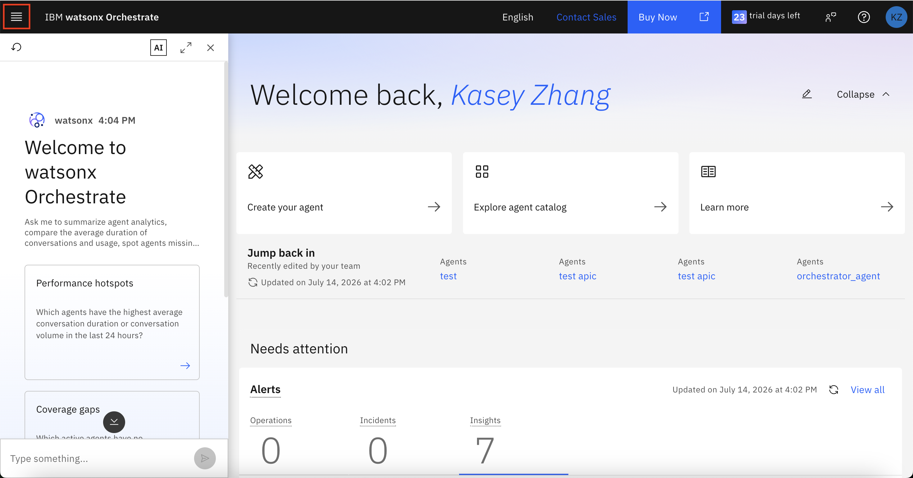
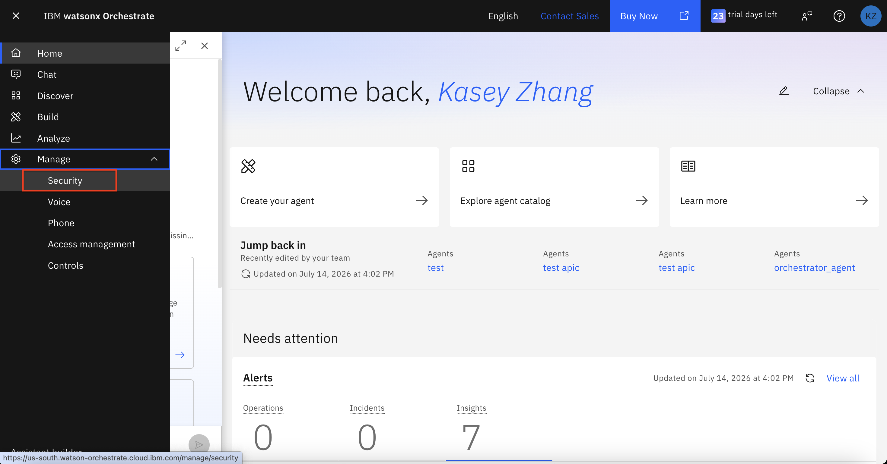

2. Click on the **Connections** tab, then click on the **Add connection +** box.

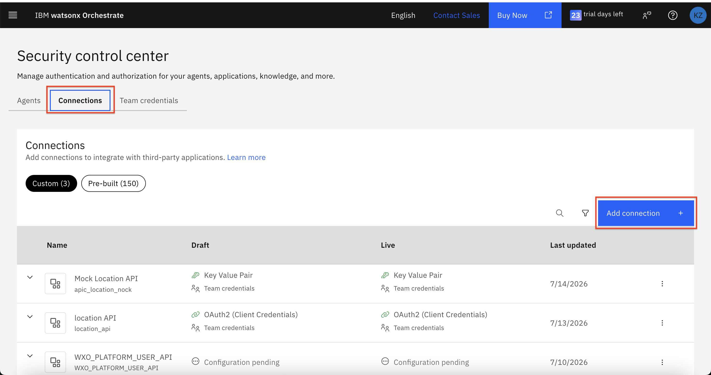

3. In the **Connection ID** field, enter `location_api` as the connection name. Enter `NYS DOE Location API` as the **Display Name**. You may also optionally add a description field. Click **Save and continue** at the bottom right. A confirmation message will pop up and ask you if you want to continue, you can go ahead and click **Continue**.

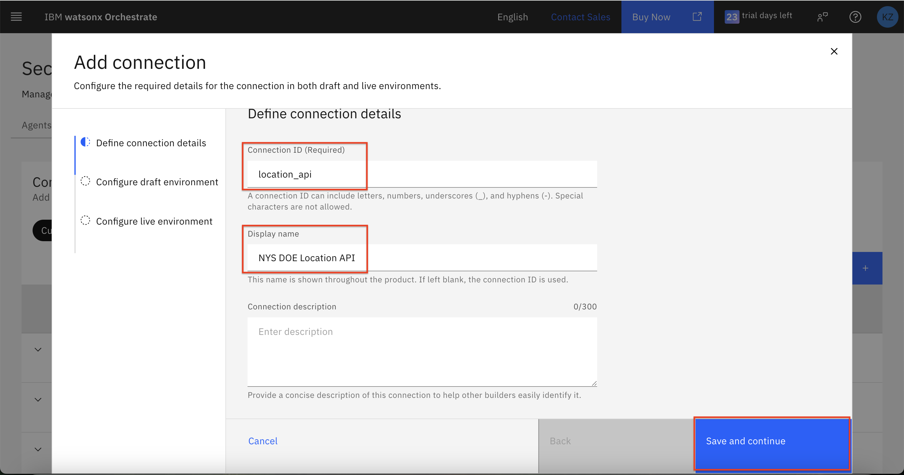

4. In the **Configure draft connection page**, leave **Signle sign-on(SSO)** off. Under **Authentication type**, select **OAuth 2.0 — Client Credentials**. 

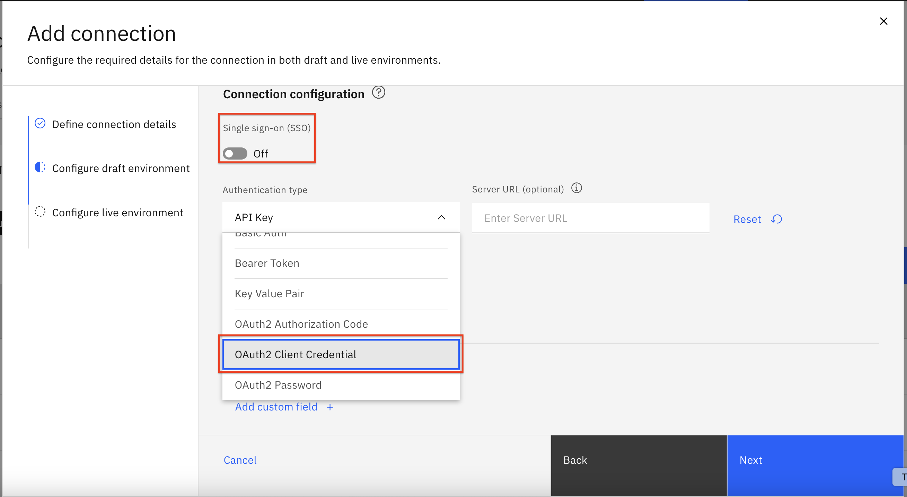


5. Fill in the following fields, you can leave the other fields as is. Then, scroll down to select **Team credentials** as the credential type, then scroll down to the **Credential type** section:

   | Field | Value |
   |---|---|
   | **Token URL** | `https://apistg.schools.nyc/doe/stg/v1/oauth/oauth2/token` |
   | **Client ID** | `Ask your instructor` |
   | **Client Secret** | `Ask your instructor` |
   | **Scope** | `location` |

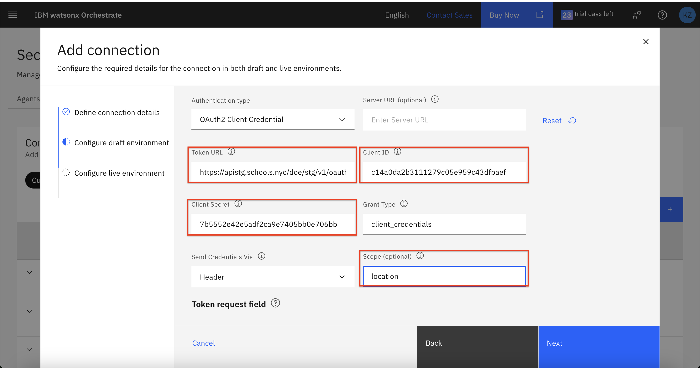

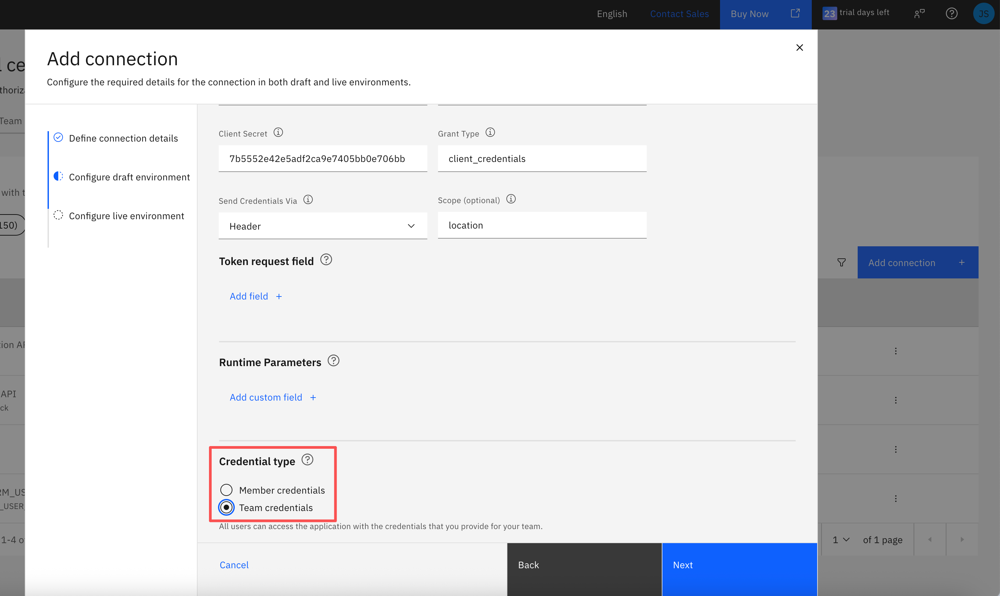

6. In the **Configure live connection** page, you can click **Paste draft configuration**. It will automatically populate the values you filled in for the draft configuration.

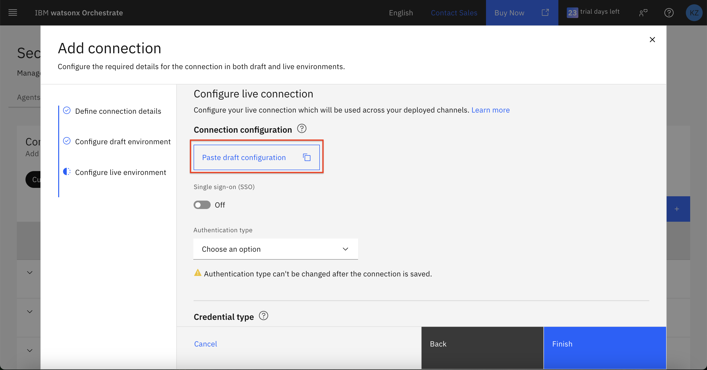

7. Click **Finish**

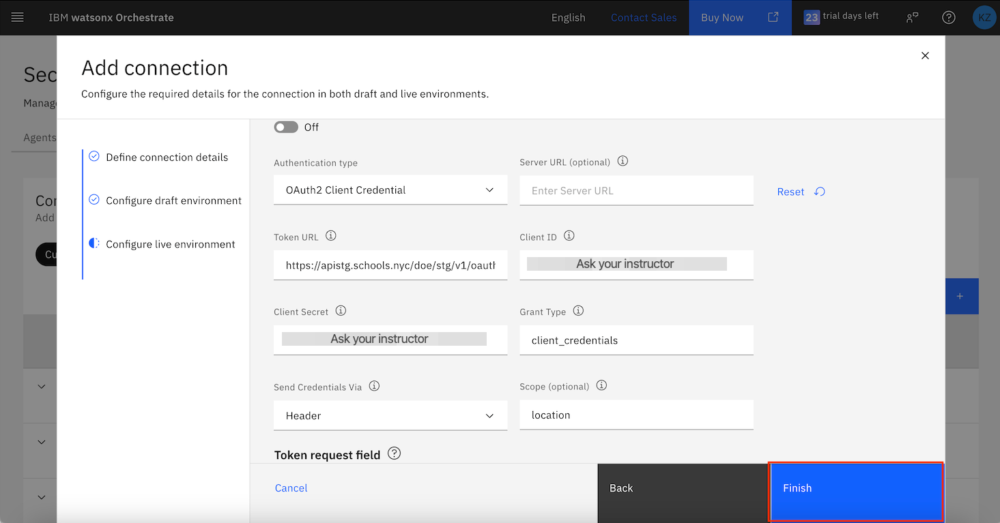

> ✅ You should see the connection status change to **Connected**. If it shows an error, double-check the Client ID and Secret — make sure there are no extra spaces.

---

### Step B: Import the necessary tools (NYC Location API tool, Security API tool, and Facilities API tool) 

Please download the 3 yaml files in the **"Tools"** folder of this repository. If you are unable to download or access these tools, please ask an instructor for assistance. 

The NYS Location API tool calls the real NYSDOE Location API and returns the list of schools (`schoolDBN`) and offices (`locationCode`) for a district. The Security and Facilities APIs are mock services that simulate door locking, HVAC control, room booking, and principal alerts. They accept the same `schoolDBN` and `locationCode` values returned by the real Location API.

The file names are as follows:
nysdoe_location_api.yaml
nysdoe_facilities_api.yaml
nysdoe_security_api.yaml


1. In Watson Orchestrate, click on the hamburger menu in the top left corner, and click **Build** in the left navigation panel.

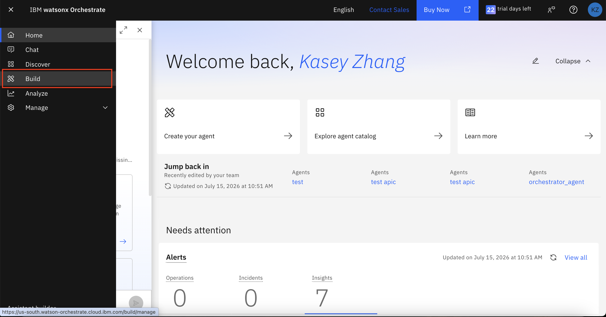

2. Navigate to the **All Tools** tab, and click **Create tool**.

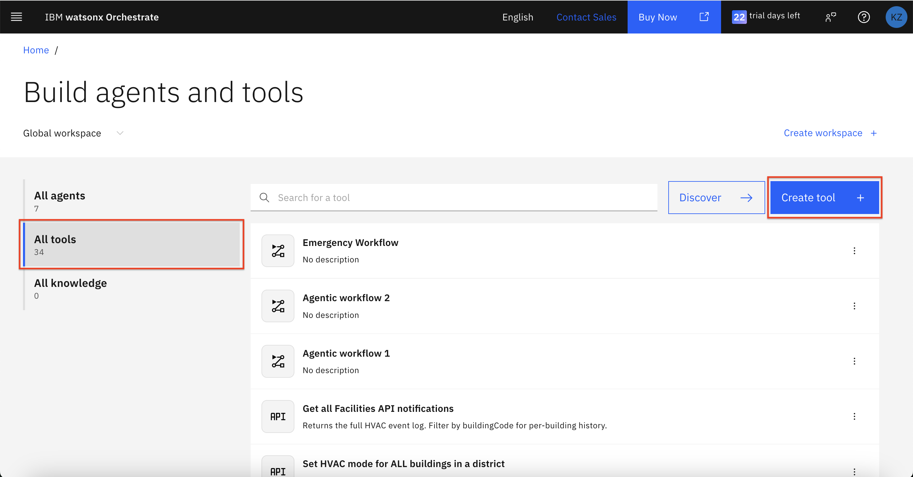

3. Click **OpenAPI** to import your OpenAPI yaml files. On the **Upload files** page, either drag and drop your file or click to upload the yaml file you recieved from your instructor. Then, click **Next**:

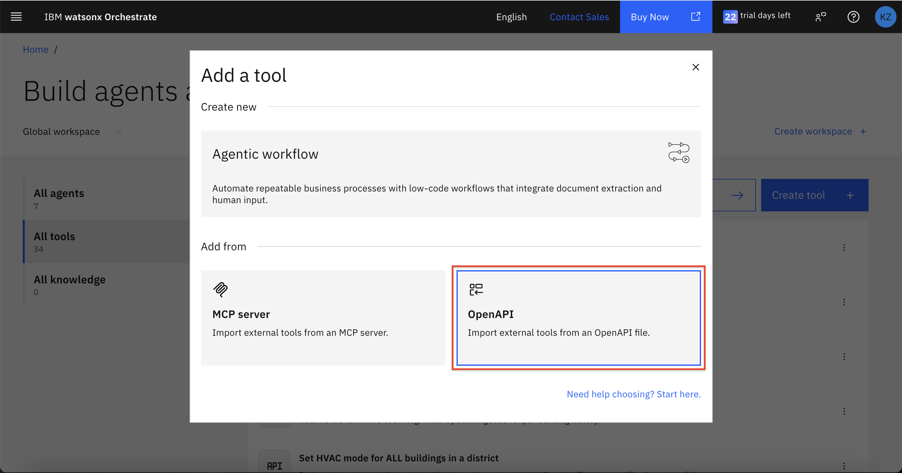
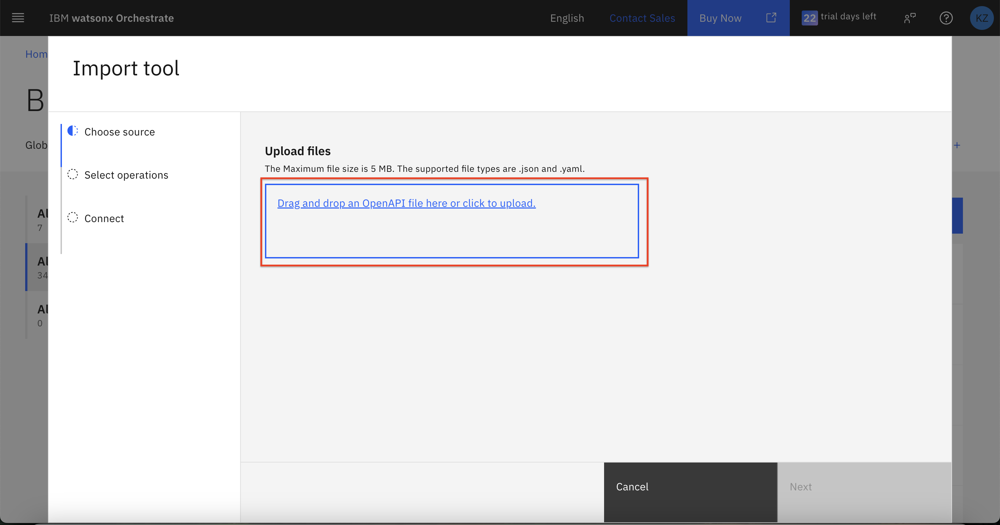


4. On the **Operations** page, click the topmost check box to select all tools. Then, click **Next**.

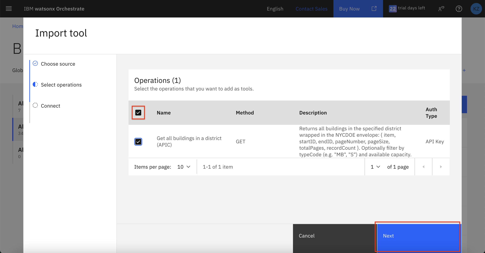

5. On the **Connections** page, select the connection you made in **Step A**. (It should be named NYS DOE Location API). Click **Done**.

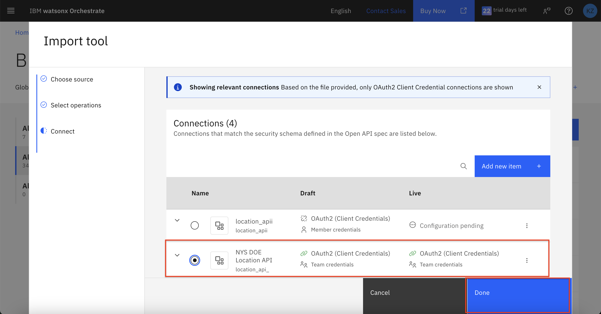

6. Repeat the above steps for each yaml file. **Note:** the security and factilities yamls contain multiple tools, so make sure you select all tools. Security and Facilties yaml upload will **not** require a connection set up.

7. ✅ After importing all 3 files confirm the following tools appear in your tool list:

   - `getDistrictAdminDetails` *(Location API — real)*
   - `bookBuilding` *(Facilities API — mock)*
   - `bulkSetHVAC` *(Facilities API — mock)*
   - `setDoorState` *(Security API — mock)*
   - `bulkAlertPrincipals` *(Security API — mock)*

If any are missing, ask your instructor before proceeding.

---
## Part 1 — Building the Operations Use Case - "Automated District Relocation"

> **Scenario:** A water main has broken at a middle school in District 4. The Operations workflow will automatically find a relocation building, book rooms, and draft parent and staff notification emails.

### The flow we are building:

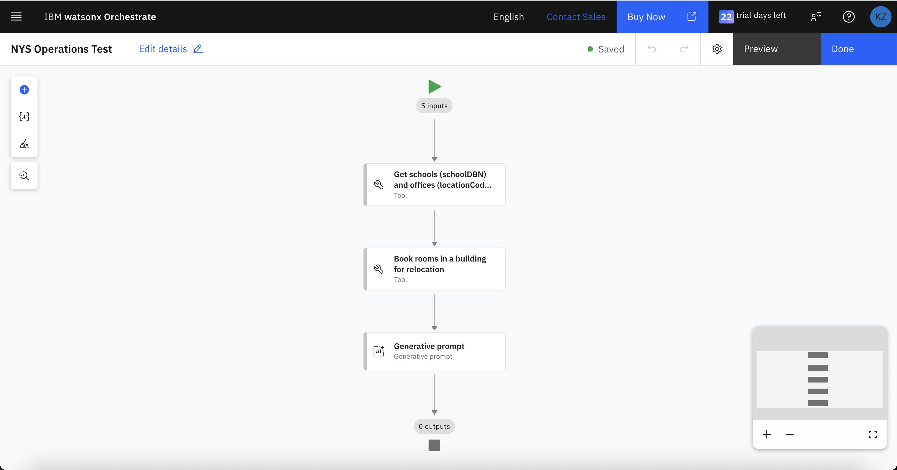

We will now walk through creating the above workflow step by step.

---

### Step 1: Create the Operations Agent

1. Open the Agent Builder in Watson Orchestrate by clicking **Build** from the lefthand navigation menu.


2. Click **Create Agent**, then select **Create from scratch**.

Name the agent:
```
operations_agent
```

Give it the following description:
```
Handles NYSDOE district-level facility disruptions. Given a disruption trigger (water main break, power outage, building closure), this agent finds available relocation buildings, books rooms, and drafts parent and staff notification emails.
```

Then, click **Create**

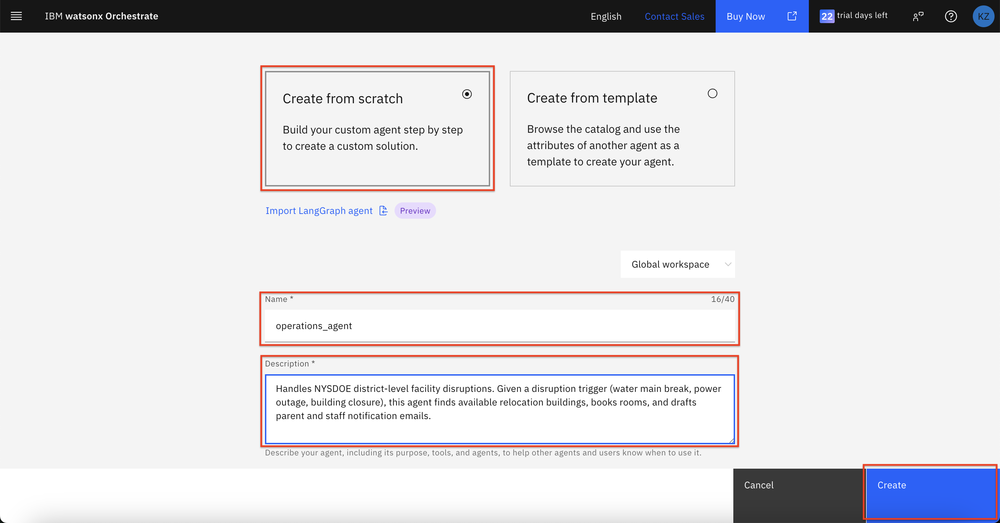

4. Scroll down to the **Behavior** (Instructions) section and enter:

```
You are the NYSDOE Operations Agent. When a facility disruption is reported,
invoke the relocation_flow tool immediately — do not ask questions first.

Extract these inputs from the message:
- district_id, affected_building_name, affected_buildingCode, disruption_type, rooms_needed, start_date

affected_buildingCode is the schoolDBN of the disrupted building (e.g. "M057"). It is used to
prevent that building from being booked as its own relocation site. If the user does not provide
it, ask for it once before invoking the flow.

If district_id cannot be determined, ask for it once before invoking the flow.

Present the full flow output to the user (booking confirmation, relocation plan,
parent email, staff email), then ask:
"Would you like to send these notifications? Reply YES to confirm or NO to discard."

If no suitable building is found, report it clearly and suggest escalating to the Orchestrator.
```

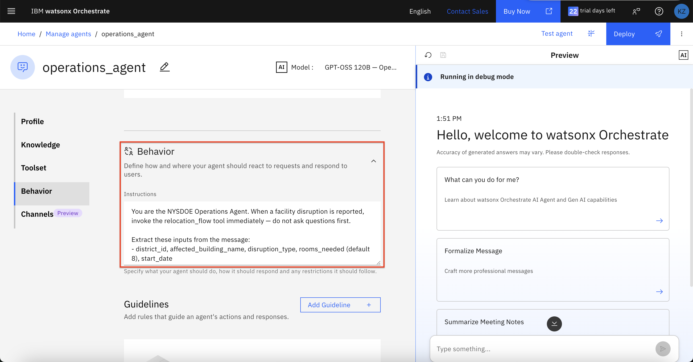


### Step 2: Create the Operations Workflow

Now we will create the Operations Workflow within our Operations Agent. 

1. Scroll down to the **Toolset** section and click **Add Tool**:

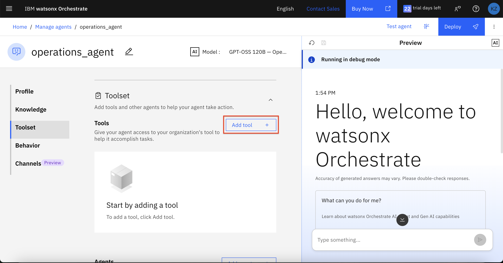

2. Select **Agentic workflow**:

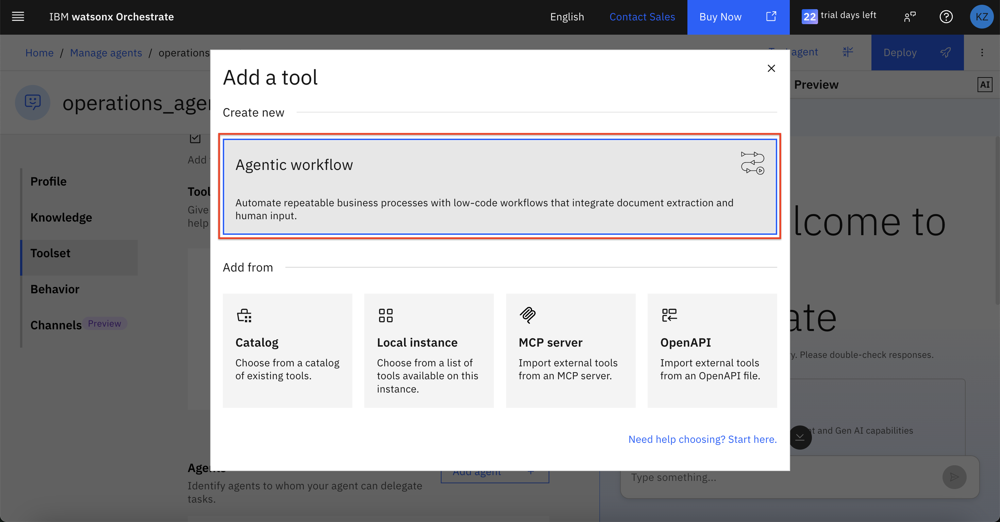

3. The flow editor will open and prompt you to name your agentic workflow. You can also click edit details to update the Name and Description fields. Then click **Done** to save.


Change the name to:
```
relocation_flow
```

Change the description to:
```
Finds available relocation buildings in a district, books rooms, and drafts parent and staff notification emails.
```

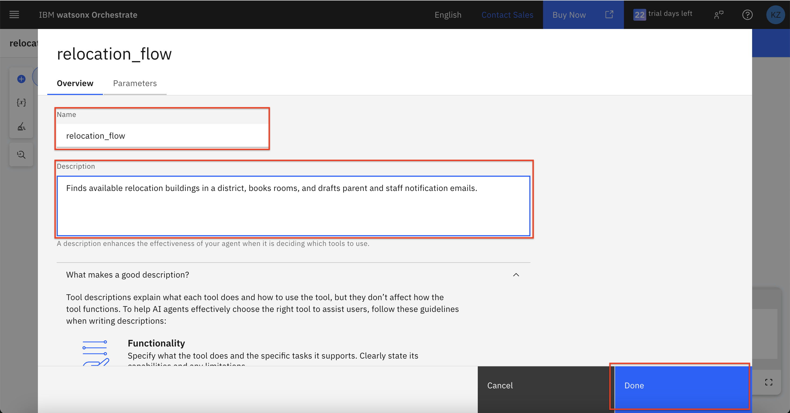

4. Click on the green "play" button to open the **Inputs**. Click **Add** to add input variables to your workflow. 

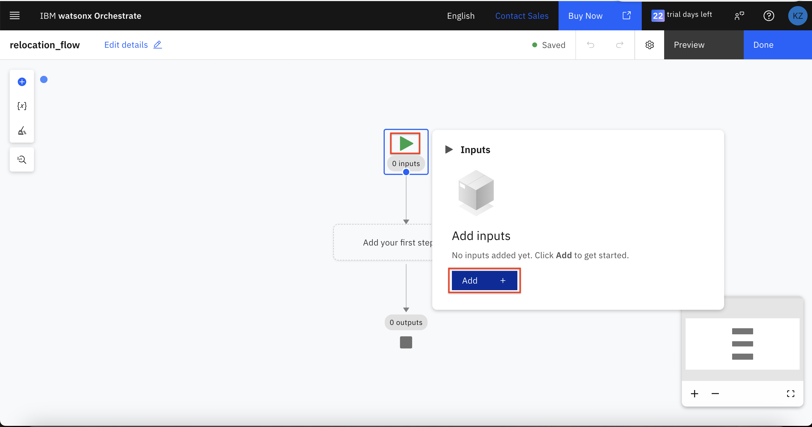

5. Select the variable type **String** and name your variable **district_id**. Make sure the **Required** field is toggled **ON**. Then, click **Add**

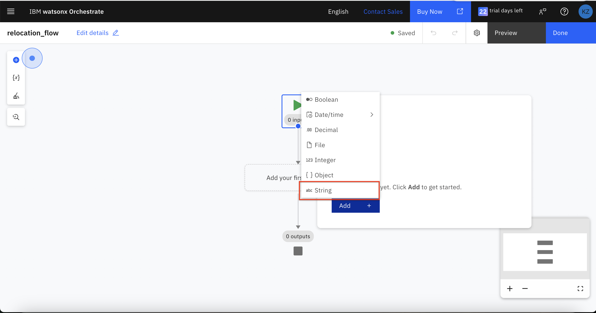

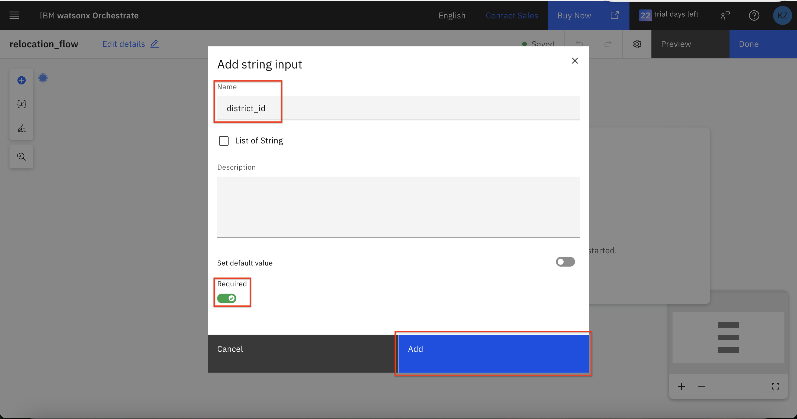

6. Repeat this process for the following variables, making sure to set the correct variable type and to toggle required for each one.

| Variable name | Type | Required | Description |
|---|---|---|---|
| `district_id` | String | Yes | Numeric district ID, e.g. `"4"` |
| `affected_building_code` | String | Yes | schoolDBN of the disrupted building, e.g. `"M057"` — prevents it from being booked as its own relocation site |
| `disruption_type` | String | Yes | e.g. `"water main break"` |
| `rooms_needed` | Integer | Yes | Number of rooms needed |
| `start_date` | String | Yes | Format: `YYYY-MM-DD` |

7. ✅ If you click on the green play button to view all inputs, it should look something like this: 

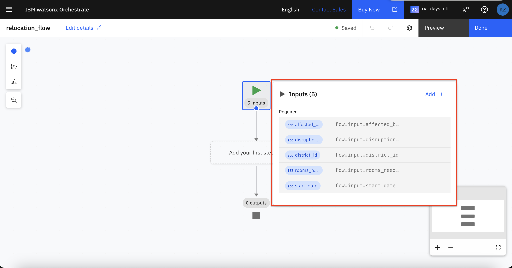

8. Click on the dashed box labeled **Add your first step +** and click **Call a tool**. 

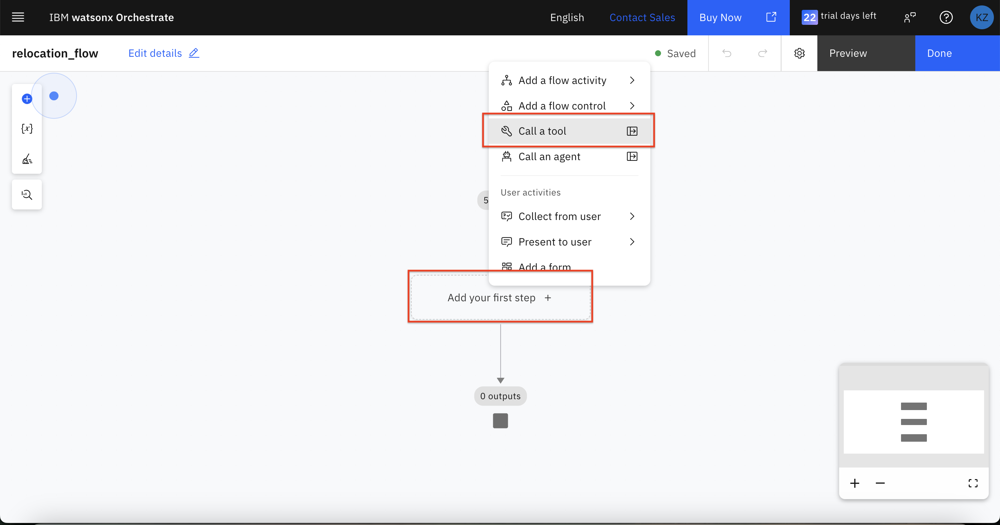

9. A tools page will open on the left side of the screen. In the search bar, type in `getDistrictAdminDetails` and drag and drop it to the flow:

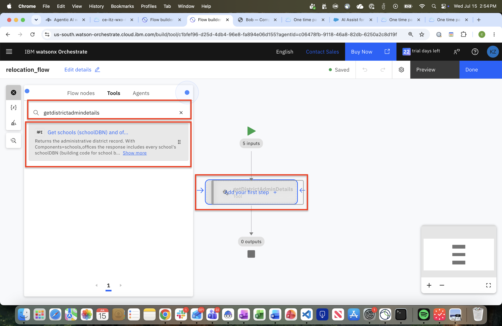

10. Hover over the arrow connecting the "Get schools and offices" (added in the previous step) to the End node and click **+**. Select **Call a tool**.

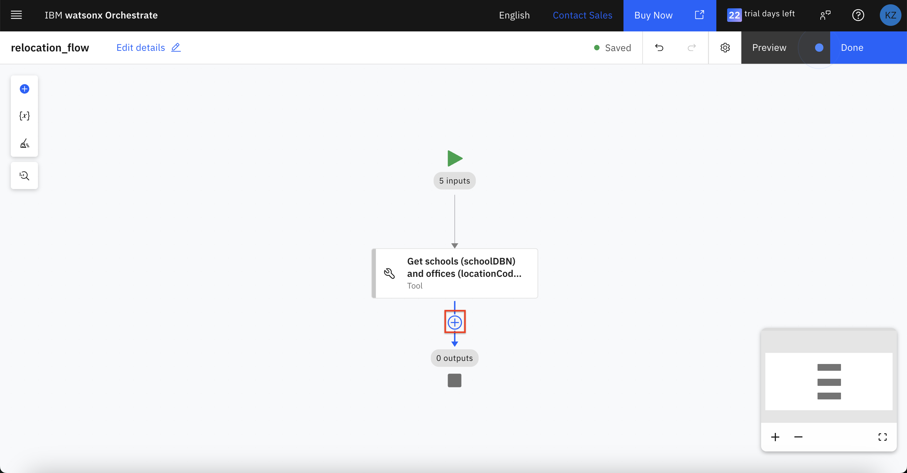

11. In the **Tools** search bar, search for `bookBuilding`. Same as before, drag and drop it below the "Get schools and offices" tool before the output/end node.

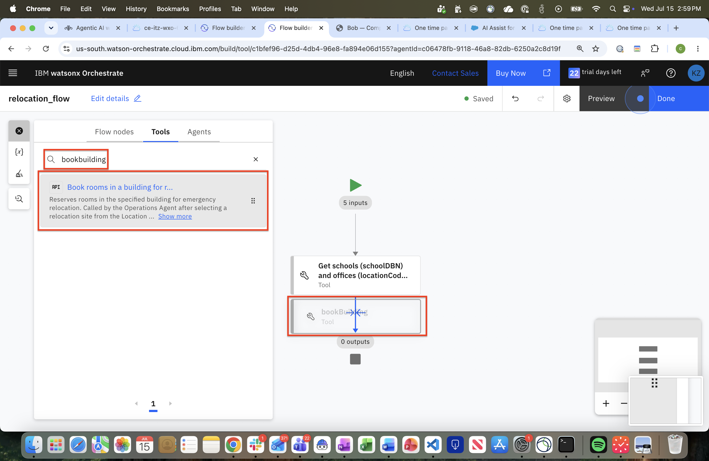

12. Hover over the arrow connecting "Book rooms in a building" to the End node and click **+**. Select **Add a flow activity** and then click **Generative prompt**:

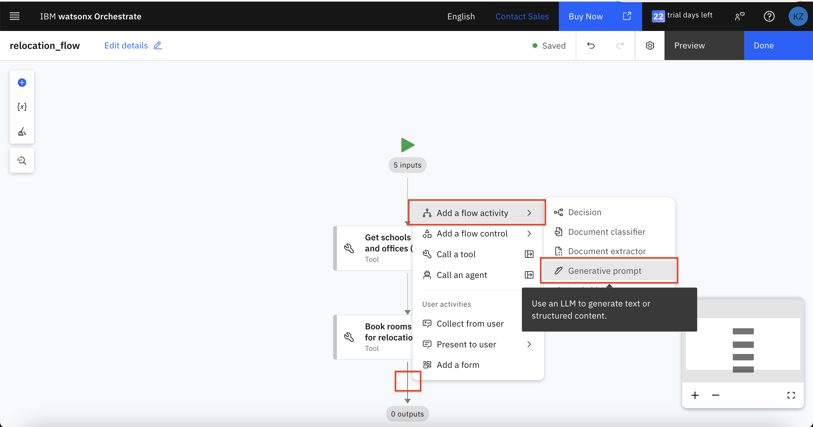

13. In the **System prompt** enter in the following:

```
You are the NYSDOE Operations Agent. You produce professional, clear district 
communications and operational plans. Always fill every field with real values 
— never use placeholders.
```

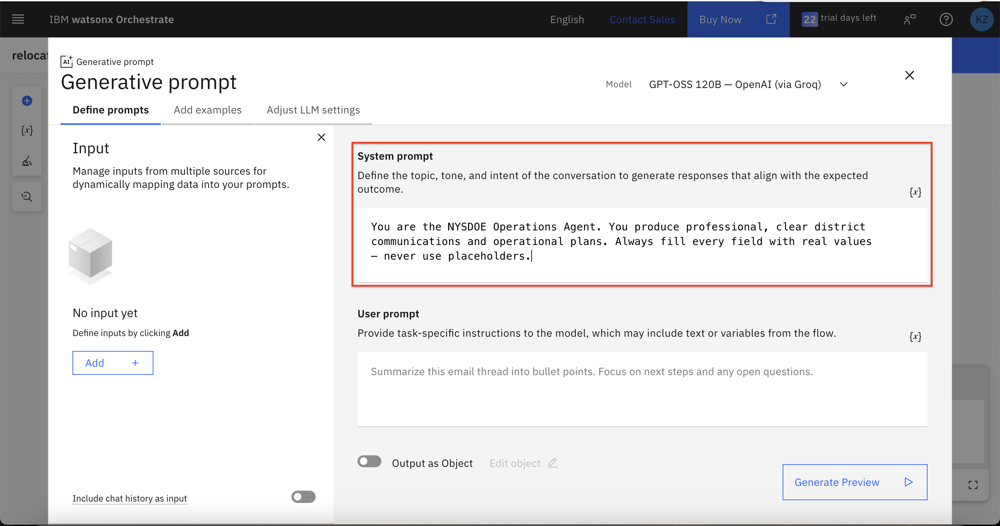

14. In the **User prompt** enter in the following:

```
A facility disruption has occurred. Using the details below, produce the full relocation output.

DISRUPTION DETAILS:
- Affected building: {flow.input.affected_building_code}
- District: {flow.input.district_id}
- Disruption type: {flow.input.disruption_type}
- Effective date: {flow.input.start_date}

BOOKING CONFIRMATION (from API):
- Booking ID: {flow["Book rooms in a building for relocation"].output.booking_id}
- Relocation building: {flow["Book rooms in a building for relocation"].output.buildingName}
- Relocation building code: {flow["Book rooms in a building for relocation"].output.buildingCode}
- Rooms booked: {flow["Book rooms in a building for relocation"].output.rooms_booked}

Produce the following four sections, clearly separated.
IMPORTANT: The affected building ({flow.input.affected_building_code}) is being EVACUATED.
The relocation building ({flow["Book rooms in a building for relocation"].output.buildingName})
is the NEW TEMPORARY SITE. Never confuse the two.

## ✅ BOOKING CONFIRMED
A short confirmation (3–4 lines): state the affected building being evacuated,
the new temporary site name and address, booking ID, rooms booked, and effective date.

## 📋 RELOCATION PLAN
A structured operational plan for the operations team. Include:
1. Immediate actions (Day 0 — {flow.input.start_date})
2. Logistics (Day 1): room setup, IT transfer, student records, meal service
3. Communications: confirm emails sent, update district website
4. Responsible parties: assign each step to a role
5. Return plan trigger: define the condition to return to {flow.input.affected_building_code}

## 📧 PARENT EMAIL
Subject: Important: School Relocation Notice — {flow.input.affected_building_code}

A full professional parent notification email. Include what happened, the new
temporary site name and full address, effective date, next steps, and contact info.

## 📧 STAFF EMAIL
Subject: STAFF NOTICE: Facility Relocation — {flow.input.affected_building_code}

A full professional staff notification email. Include the disruption detail,
new site name and address, booking confirmation ID, facilities notes, and contact info.
```

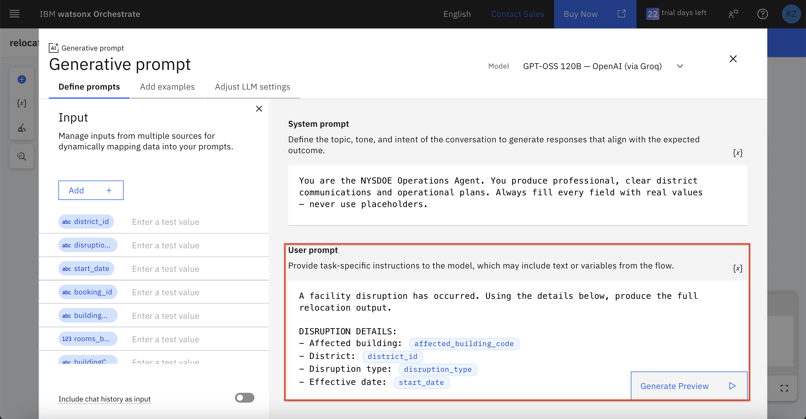

Once you are satisfied with the prompts, you can close the prompt settings.

15. Click on the grey stop button at the bottom of the flow labeled **Outputs**. Add a **string** output and name it "relocation_output".

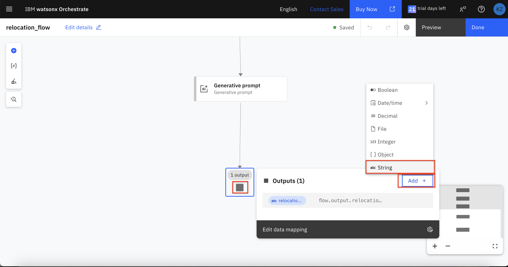

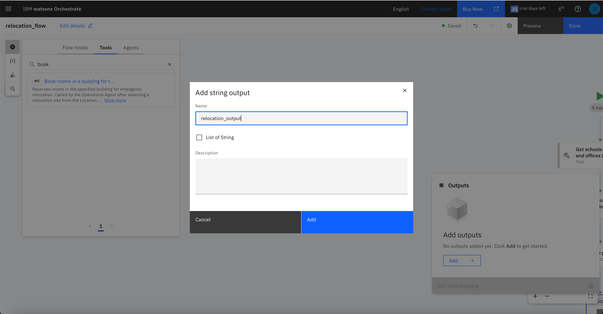

16. Click on the **Edit data mapping** button at the bottom of the **Outputs** tab, where you should now see your relocation_output string variable.

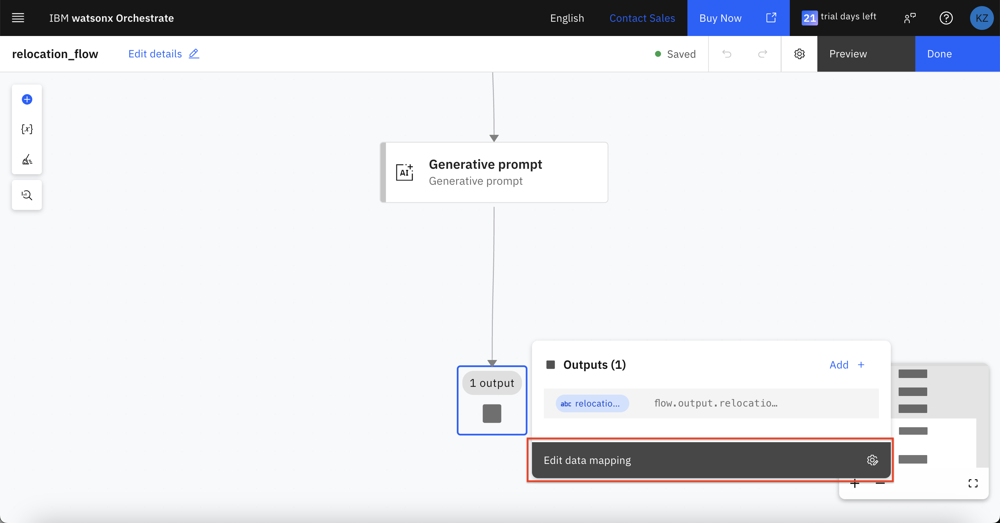

17. Click on the **{x}** button to map relocation_output to a variable.

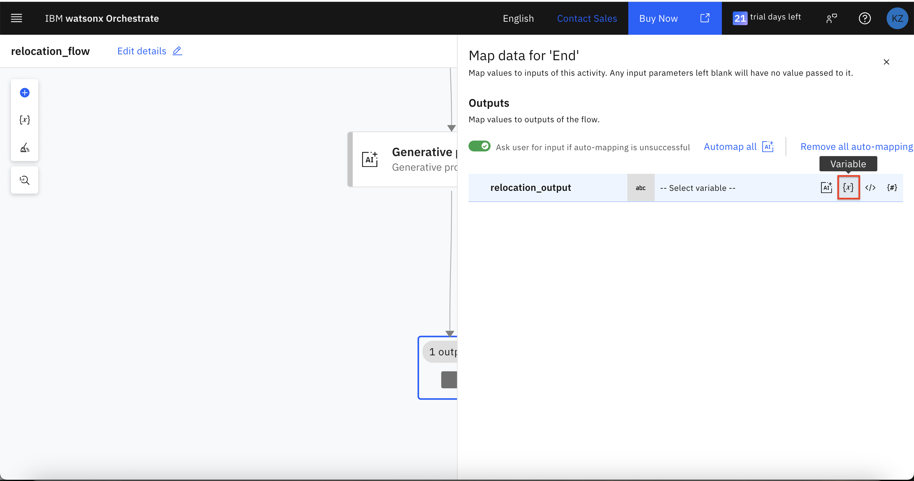

18. Click on **Generative prompt** then select **value**. You should now see the relocation_output variable being mapped to **Generative prompt.value**. You can exit out of the data mappings page once this looks correct.

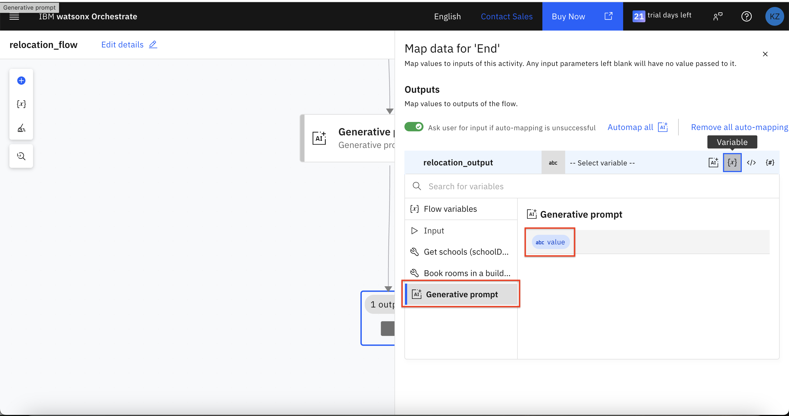

19. Finally, click **Done** at the top right hand corner to close the flow editor. Your completed flow should look like this:


---

### Step 3: Test the Operations Agent

1. In the right hand agent chat preview page, send the following message to the chat box and hit **Send**:

```
A water main broke at building (buildingCode: M007) in District 4. We need to relocate immediately.
The disruption started today and we need 4 rooms starting 2026-07-21.
```

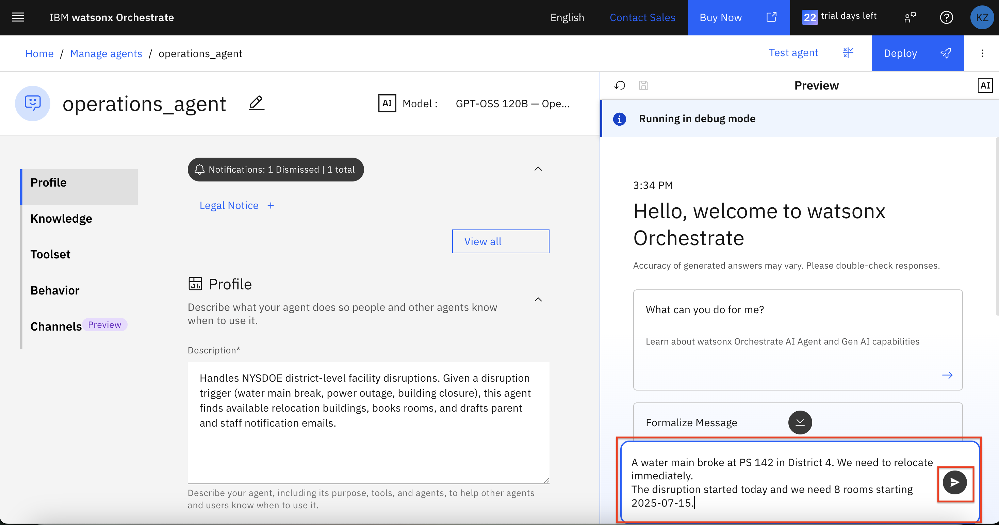

✅ The agent should call the `relocation_flow` and return a booking confirmation, relocation plan, and two draft emails. You can click on the **Show Reasoning** tab to open up the step by step reasoning process.

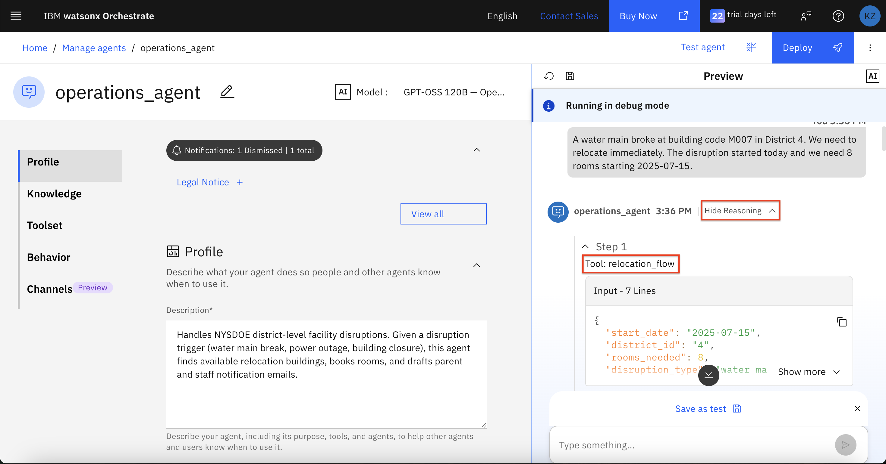
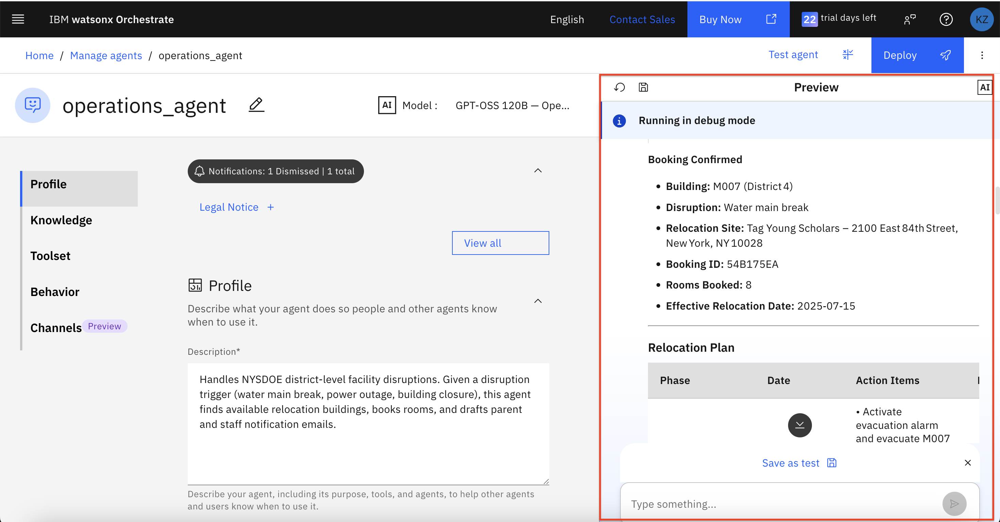

✅ The `relocation_flow` is built and the `operations_agent` is ready.

---

## Part 2 — Building the Emergency Use Case - "District-Wide Threat Response"

> **Scenario:** A tornado watch has been issued for District 7. The Emergency Response workflow will automatically fetch all buildings in the district, bulk-alert school principals by SMS, switch office HVAC to low power, lock office doors, and produce a full incident report.

### The flow we are building:

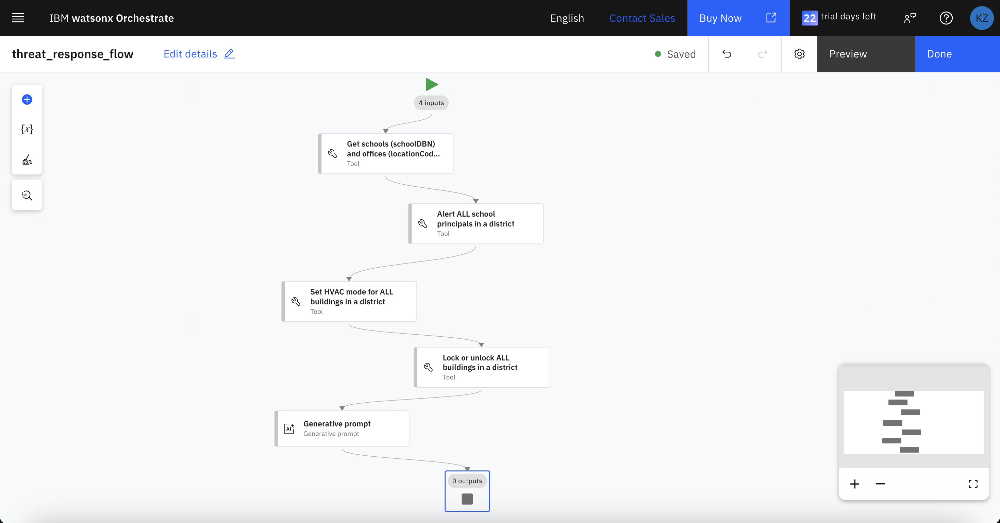

We will now walk through creating the above workflow step by step.

---

### Step 1: Create the Emergency Response Agent

1. In the **Agent Builder** (Click on the hamburger menu, click Build), click **Create Agent** → **Create from scratch**.

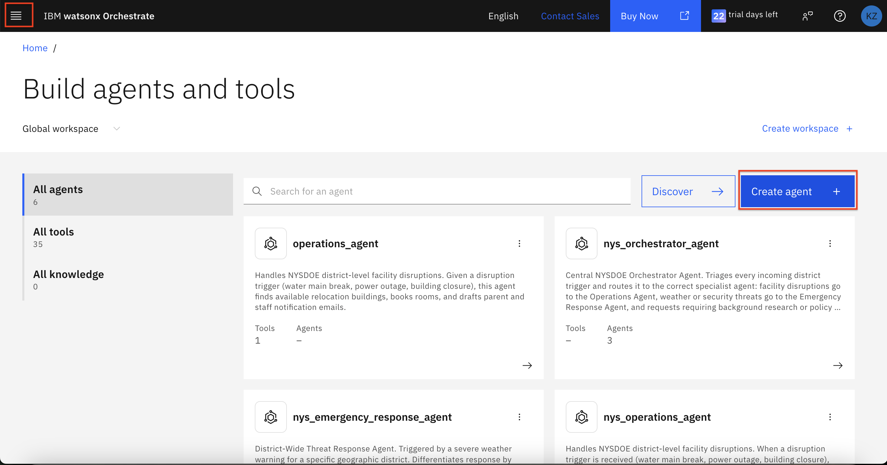

Name the agent:
```
emergency_response_agent
```

Give it the following description:
```
District-Wide Threat Response Agent. Triggered by a severe weather warning for a specific geographic district. Differentiates response by building type: for schools it bulk-alerts every principal by SMS; for office buildings it switches HVAC to low-power mode and remotely locks all doors. Returns a full timestamped incident report.
```

Then, click **Create**.

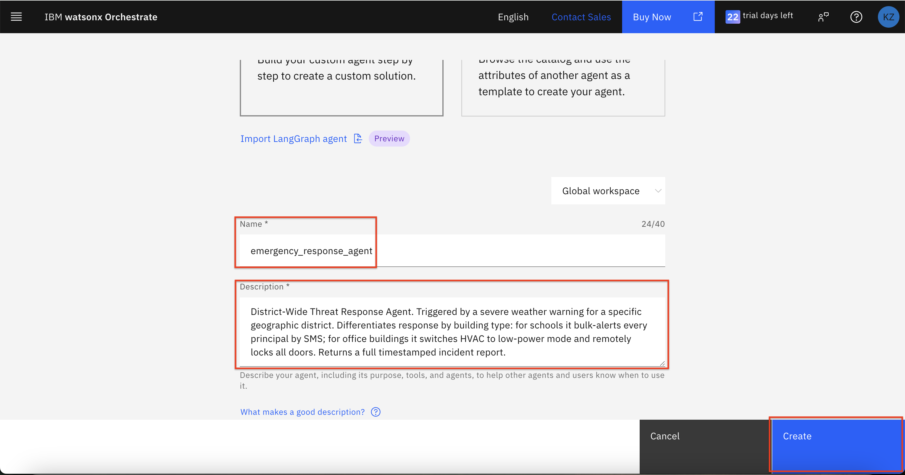

2. Scroll down to the **Behavior** (Instructions) section and enter:

```
You are the NYSDOE Emergency Response Agent for district-wide threat response.

When a weather warning is reported, collect the district_id, threat_type, and
severity from the user, then call threat_response_flow immediately.
That flow handles all response steps — fetching district buildings, alerting
school principals, securing office HVAC, locking office doors, and drafting
the incident report.

Present the returned incident report clearly to the user. If any principals
were skipped or any office actions need verification, highlight them so the
operator can follow up.
```

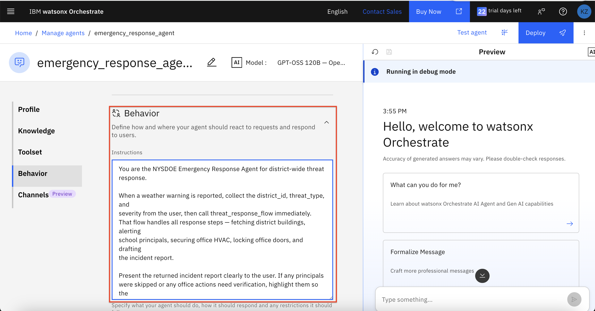

---

### Step 2: Create the Emergency Response Workflow

Now we will create the Emergency Response Workflow within our Emergency Response Agent.

1. Scroll down to the **Toolset** section and click **Add Tool**:

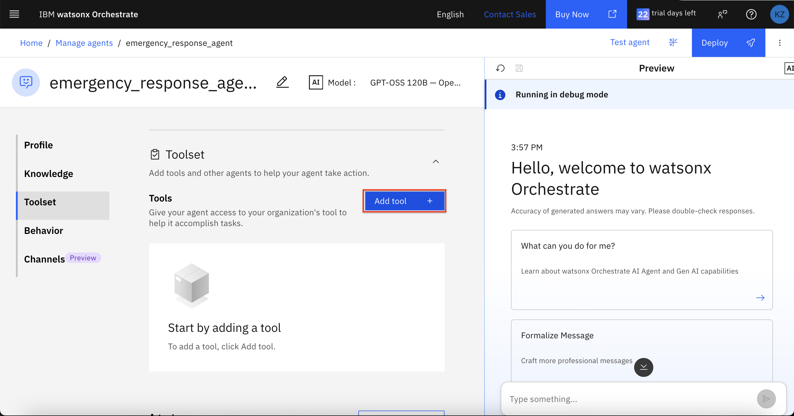

2. Select **Agentic workflow**:


3. The flow editor will open and prompt you to name your agentic workflow. You can also click **edit details** to update the Name and Description fields, then click **Done** to save.


Change the name to:
```
threat_response_flow
```

Change the description to:
```
Finds district buildings, bulk-alerts school principals, secures office HVAC and doors, and drafts a full incident report.
```

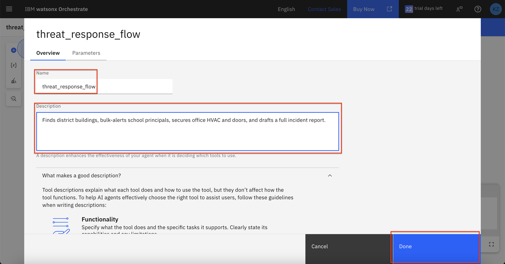

4. Click on the green "play" button to open the **Inputs**. Click **Add** to add input variables to your workflow.

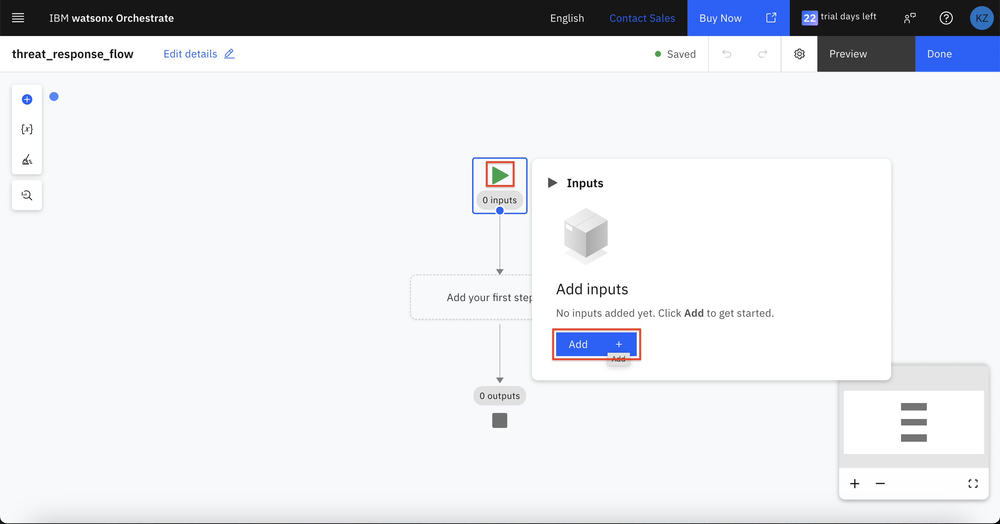

5. The same way you did for the Operations Flow, add the following input variables, making sure to set the correct variable type and toggle Required for each one:

| Variable name | Type | Required | Description |
|---|---|---|---|
| `district_id` | String | Yes | Affected district, e.g. `"7"` |
| `threat_type` | String | Yes | e.g. `"tornado watch"` |
| `severity` | String | Yes | e.g. `"high"` |
| `alert_message` | String | No | Optional custom SMS override text |

**Note:** Make sure you toggle required **OFF** for `alert_message`

The Inputs page should look like this when you're done:


6. Click on the dashed box labeled **Add your first step +** and click **Call a tool**.

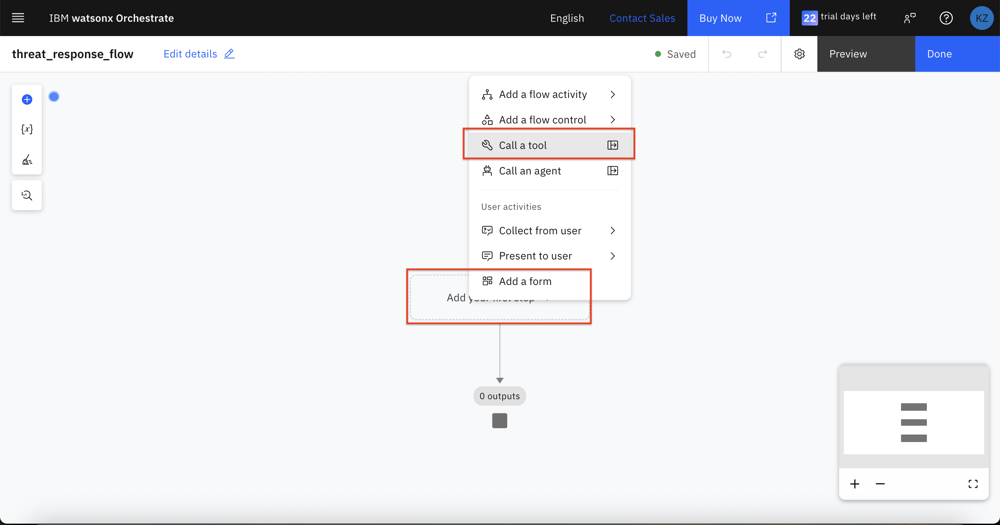

7. In the **Tools** search bar, type `getDistrictAdminDetails` and drag and drop it onto the flow:

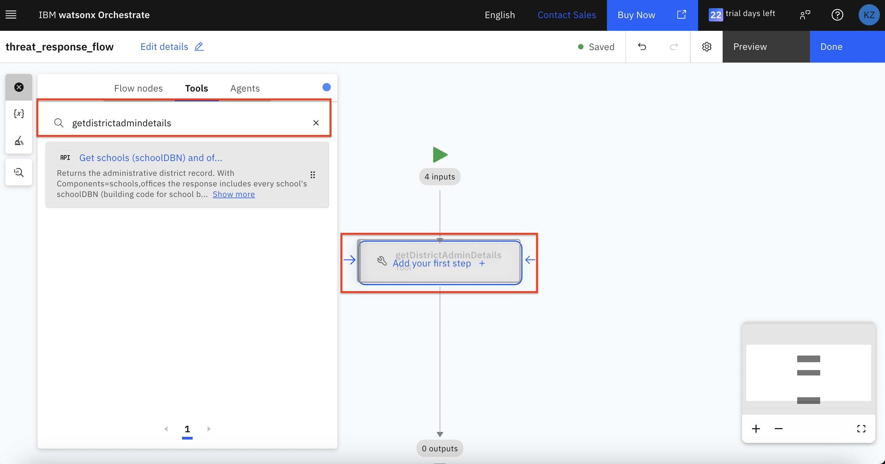

> 💡 This calls the real NYC Location API. The response gives you `schools[].schoolDBN` (school building codes) and `offices[].locationCode` (office building codes). The next nodes use these to alert principals and secure the superintendent office.

8. Hover over the arrow after the "Get schools and offices" node and click **+**. Select **Call a tool**, search for `bulkAlertPrincipals`, and drag and drop it onto the flow:

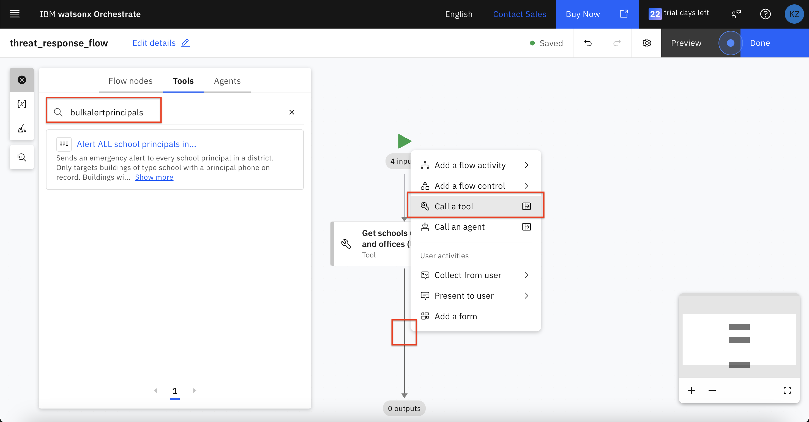

9. Hover over the arrow after the "Alert ALL school principals" node and click **+**. Select **Call a tool**, search for `bulkSetHVAC`, and drag and drop it onto the flow:

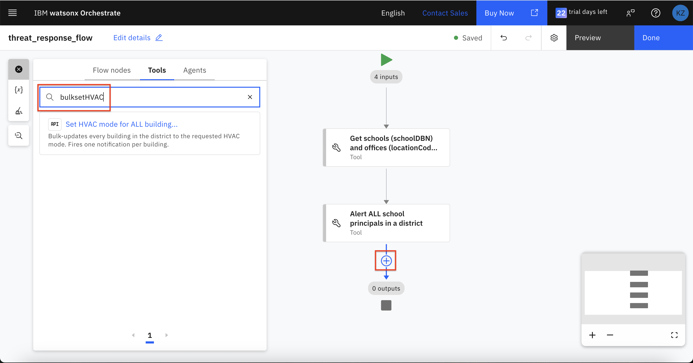

> 💡 `bulkSetHVAC` targets **all buildings in the district** by `districtCode` in a single API call. The response includes `buildings_count` so the prompt can report exactly how many offices were secured.

10. Hover over the arrow after the "Set HVAC mode" node and click **+**. Select **Call a tool**, search for `bulksetdoors`, and drag and drop it onto the flow:

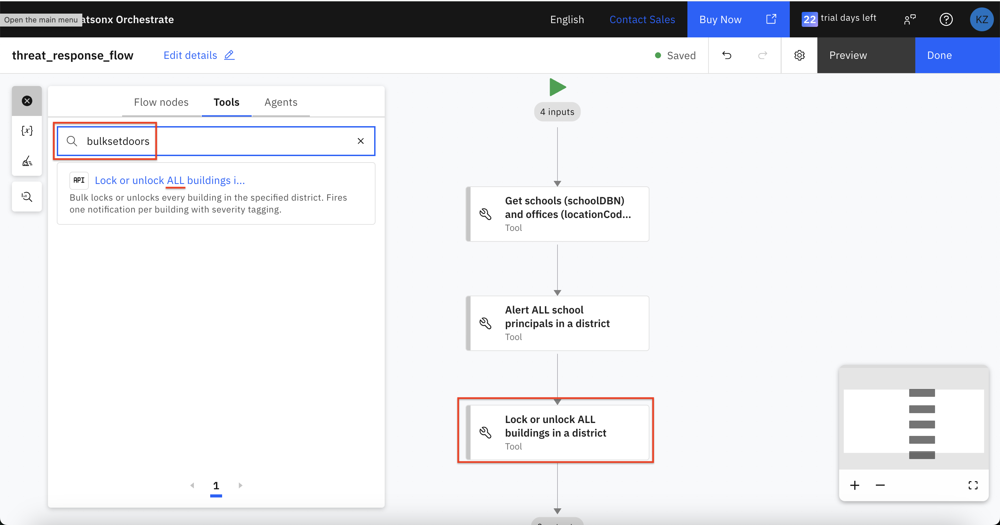

11. Hover over the arrow after the "Lock or unlock" node and click **+**. Select **Add a flow activity** then click **Generative prompt**:

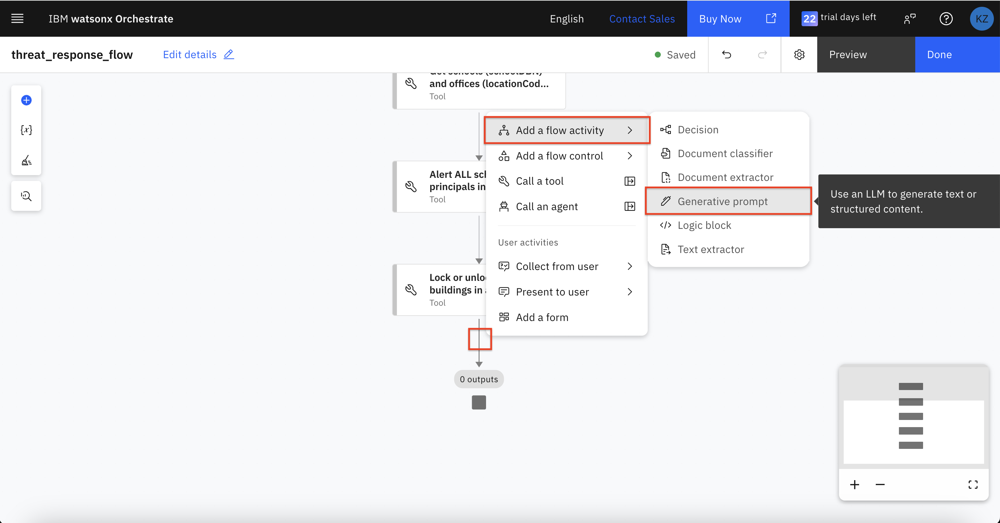

12. In the **System prompt** enter the following:

```
You are the NYSDOE Emergency Response Agent. Produce a concise, operational
incident report using only the values provided. Never use placeholders.
```

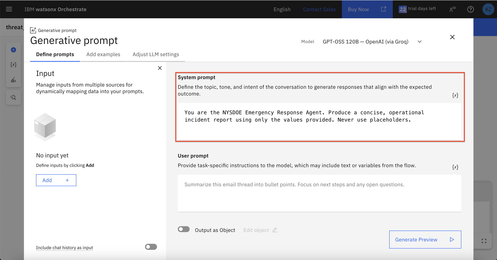

13. In the **User prompt** enter the following:

```
A severe weather warning has triggered a district-wide threat response.
Using the values below, produce a complete incident report.

THREAT DETAILS:
- District: {flow.input.district_id}
- Threat type: {flow.input.threat_type}
- Severity: {flow.input.severity}

PRINCIPAL ALERT RESULTS (school buildings):
- Principals alerted: {flow["Alert ALL school principals in a district"].output.alerted_count}
- Principals skipped (no phone on record): {flow["Alert ALL school principals in a district"].output.skipped_count}

OFFICE ACTION RESULTS (all office buildings in district):
- Bulk HVAC status: {flow["Set HVAC mode for ALL buildings in a district"].output.status}
- Door lock status: {flow["Lock or unlock ALL buildings in a district"].output.status}

Produce the following three sections, clearly separated.

## INCIDENT SUMMARY
Write a short operational summary for District {flow.input.district_id} describing
the {flow.input.threat_type} threat at severity {flow.input.severity}. Confirm that
principal SMS alerts were sent, that HVAC was bulk-set to the {flow["Set HVAC mode for ALL buildings in a district"].output.mode_set} across all office
buildings in the district, and that office doors were set to {flow["Lock or unlock ALL buildings in a district"].output.action}.

## ACTION LOG
List every completed action as a bullet:
• bulkAlertPrincipals — {flow["Alert ALL school principals in a district"].output.alerted_count} school principals alerted, {flow["Alert ALL school principals in a district"].output.skipped_count} skipped
• bulkSetHVAC — {flow["Set HVAC mode for ALL buildings in a district"].output.buildings_count} office buildings set to {flow["Set HVAC mode for ALL buildings in a district"].output.mode_set} — status: {flow["Set HVAC mode for ALL buildings in a district"].output.status}
• setDoorState — superintendent office doors set to {flow["Lock or unlock ALL buildings in a district"].output.action} — status: {flow["Lock or unlock ALL buildings in a district"].output.status}

## FOLLOW-UP
List immediate follow-up steps for the district coordinator.
If {flow["Alert ALL school principals in a district"].output.skipped_count} > 0, note that those principals require manual outreach.
If {flow["Set HVAC mode for ALL buildings in a district"].output.status} is not 'bulk_updated', flag the HVAC action for manual verification.
If {flow["Lock or unlock ALL buildings in a district"].output.status} is not 'bulk_updated', flag the door action for manual verification.
```


Once you are satisfied with the prompts, close the prompt settings.

14. Click on the grey stop button at the bottom of the flow labeled **Outputs**. Add a **string** output and name it "emergency_output".

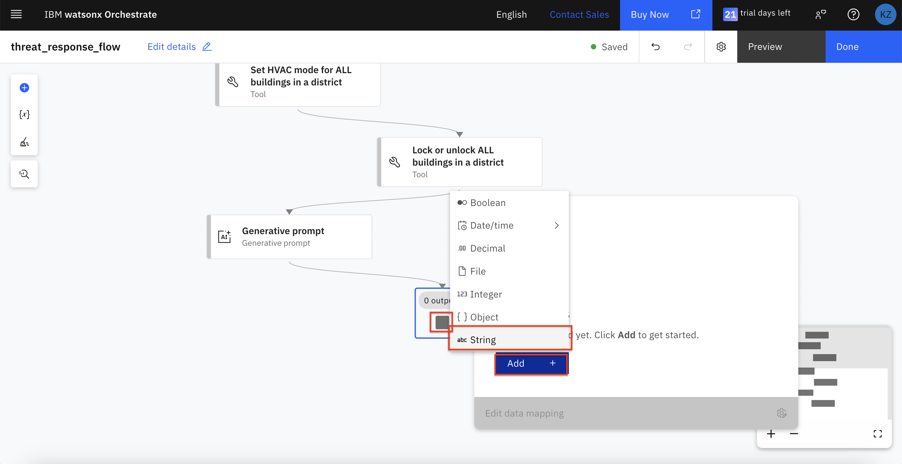

15. Click on the **Edit data mapping** button at the bottom of the **Outputs** tab, where you should now see your emergency_output string variable.

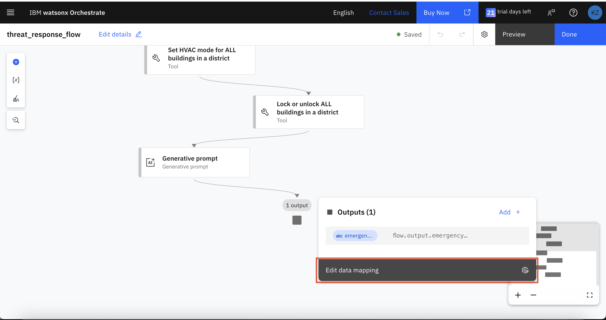

16. Click on the **{x}** button to map emergency_output to a variable.

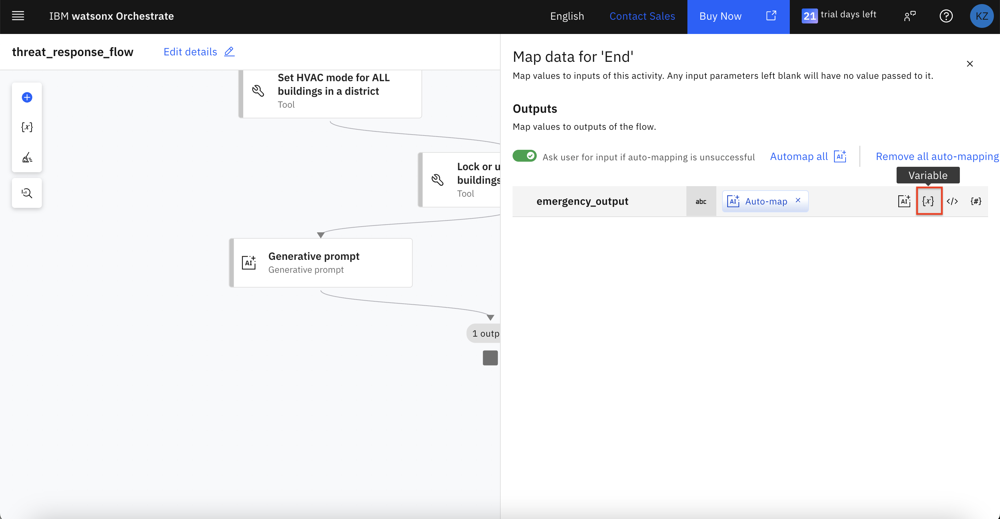

17. Click on **Generative prompt** then select **value**. You should now see the emergency_output variable being mapped to **Generative prompt.value**. You can exit out of the data mappings page once this looks correct.

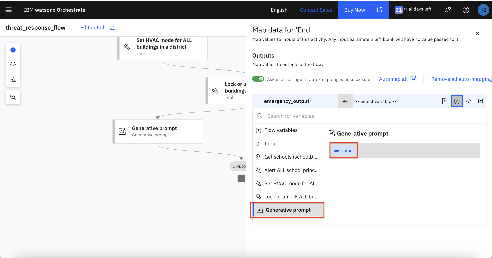

18. Finally, click **Done** at the top left hand corner to close the flow editor. Your completed flow should look like this:


---


### Step 3: Test the Emergency Response Agent

1. In the right hand agent chat preview page, send the following message to the chat box and hit **Send**:

```
A tornado watch has been issued for District 7. Severity is HIGH.
Take all necessary emergency actions across all buildings in the district.
```

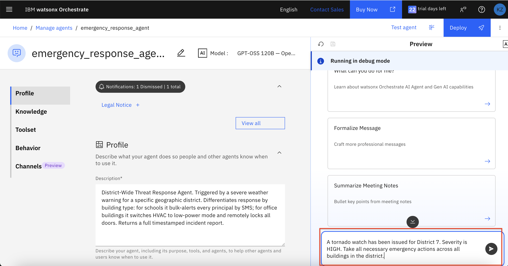

✅ The agent should call the `threat_response_flow tool` and return an incident report with an INCIDENT SUMMARY, ACTION LOG showing the new HVAC and door status values, and a FOLLOW-UP section. You can click on the **Show Reasoning** tab to open up the step by step reasoning process.

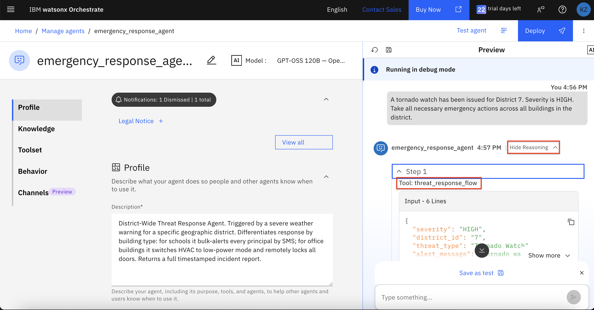
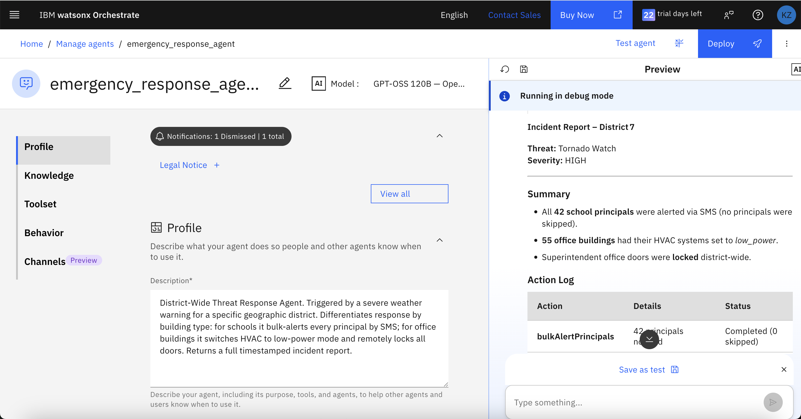

Click **Save**.

✅ The `threat_response_flow` is built and the `emergency_response_agent` is ready.

---

## Part 3 — Building the Orchestrator Agent

Both specialist agents are already built from Parts 1 and 2. In this part you will create the **Orchestrator Agent** and wire the two specialist agents to it as collaborators.

---

### Step 1: Create the Orchestrator Agent

1. In the **Agent Builder**, click **Create Agent** → **Create from scratch**.

Name the agent:
```
orchestrator_agent
```

Give it the following description:
```
Central NYSDOE Orchestrator Agent. Triages every incoming district trigger and routes it to the correct specialist: facility disruptions go to the Operations Agent, weather or security threats go to the Emergency Response Agent.
```

Then, click **Create**.

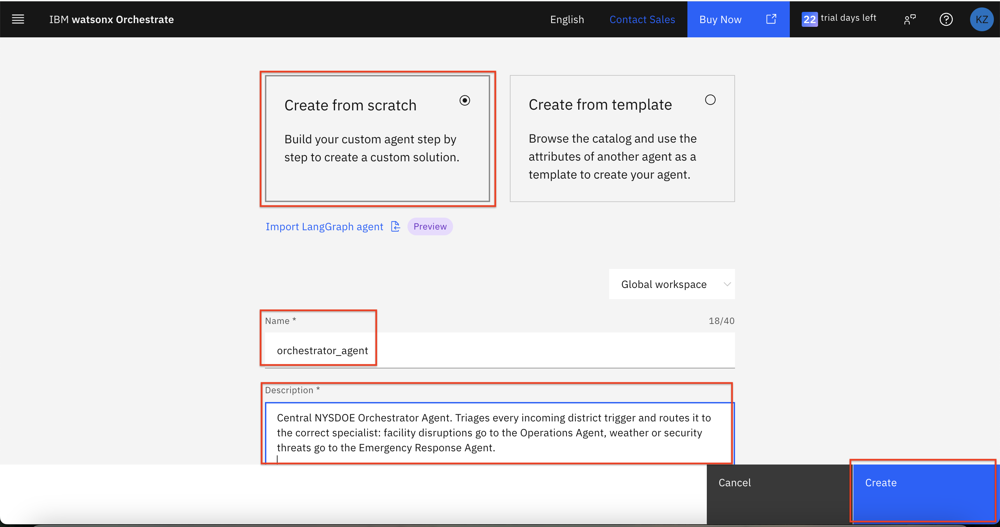

2. Scroll down to the **Behavior** (Instructions) section and enter:

```
You are the NYSDOE Orchestrator Agent. Your sole job is to triage incoming
triggers and delegate to the appropriate specialist agent. Never attempt to
handle facility operations or emergency protocols yourself.c

ROUTING RULES:

1. FACILITY DISRUPTION (water main break, power outage, building closure,
   structural damage, HVAC failure, relocation needed)
   → Route to: operations_agent
   Pass: district_id, affected_building_code, disruption_type, rooms_needed, start_date.
   OUTPUT THE FULL MESSAGE FROM flow.output.relocation_output

2. WEATHER OR SECURITY THREAT (tornado watch, ice storm, hurricane, severe
   weather warning, lockdown)
   → Route to: emergency_response_agent
   Pass: district_id, threat_type, and severity.
   OUTPUT THE FULL MESSAGE FROM flow.output.emergency_output

BEHAVIOUR:
- Extract all context from the message before routing.
- If district_id is missing, ask for it once — then route immediately.
- Do not ask unnecessary clarifying questions.
- Present the specialist agent's full output without summarising or truncating.
- If a specialist agent fails, report the failure clearly.
```

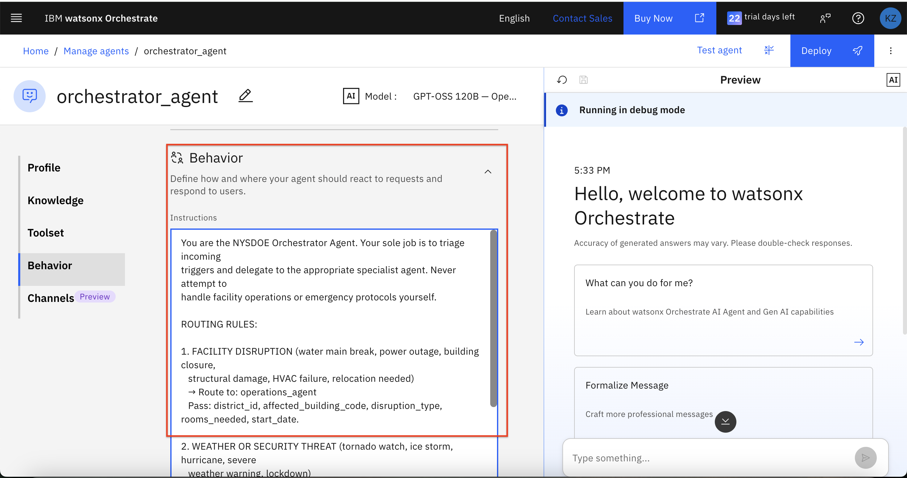

---

### Step 2: Add the Specialist Agents as Collaborators

1. Scroll down to the **Agents** section (separate from Toolset). Click **Add Agent**:

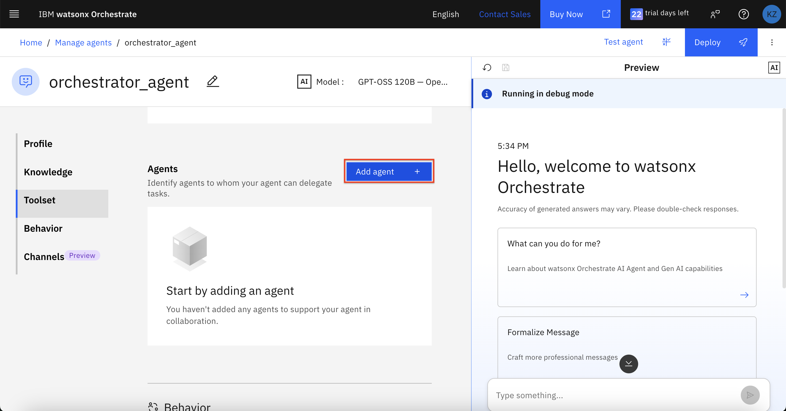

2. Click on **Local instance** to choose from a list of available agents, because we have already created our **Operations Agent** and **Emergency Response Agent**

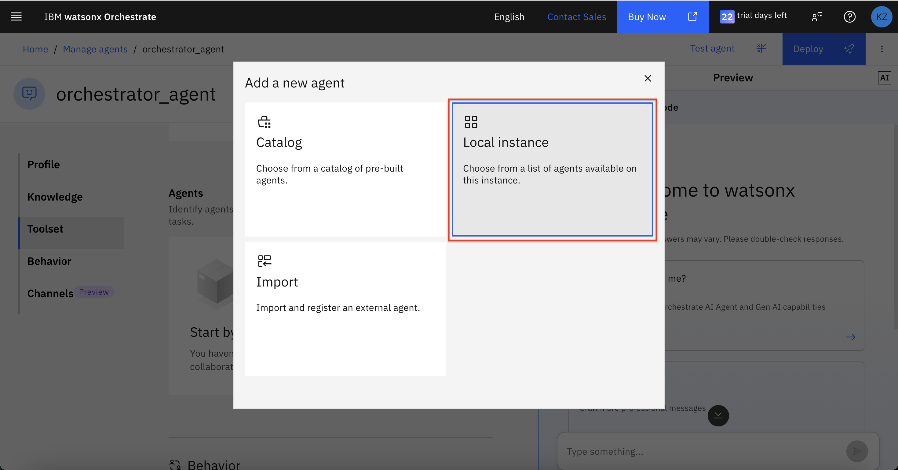

3. Search for the **Operations Agent** you made in **Part 1** and check the box next to it:

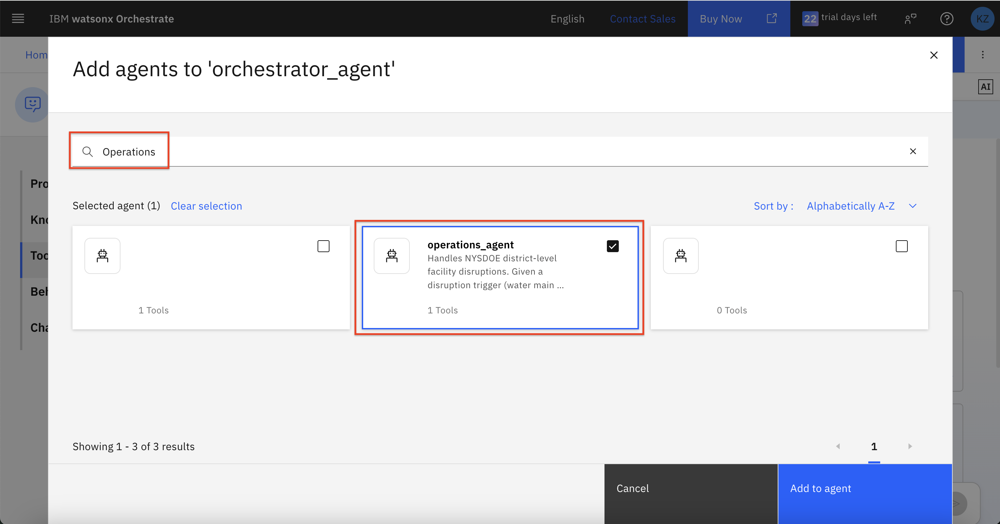

4. Repeat and check the box for the **Emergency Response Agent**. Next, click **Add to Agent** to add both selected agents to your **Orchestrator agent**:

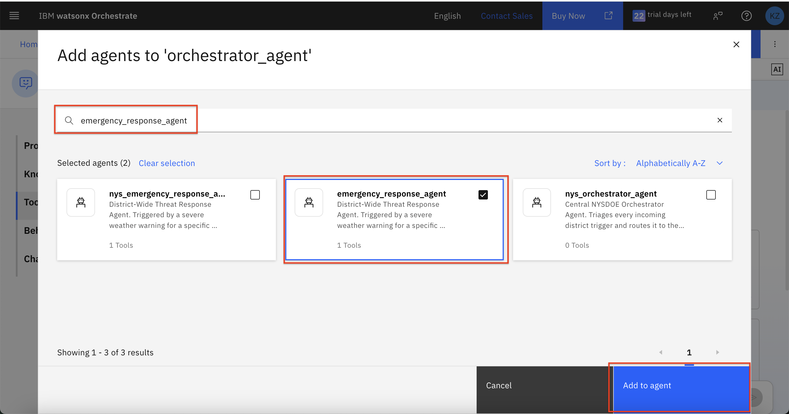

✅ Both specialist agents should now appear as collaborators under the Agents section:

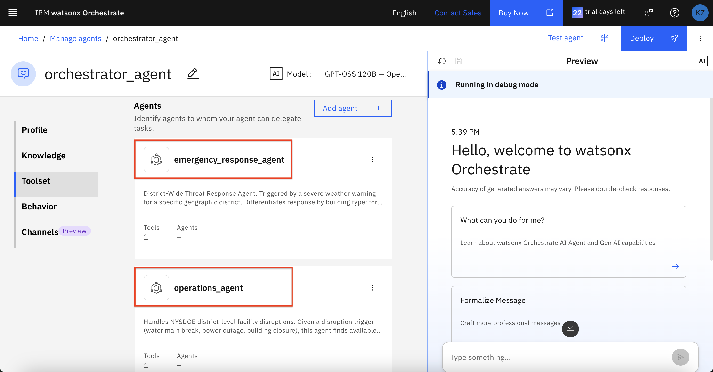

---

### Step 3: Test the Orchestrator Agent

1. In the right hand agent chat preview page, send the following message to test **The Operations Use Case — Facility Relocation**:

```
A water main broke at building (buildingCode: M007) in District 4. We need to relocate immediately.
The disruption started today and we need 4 rooms starting 2026-07-21.
```

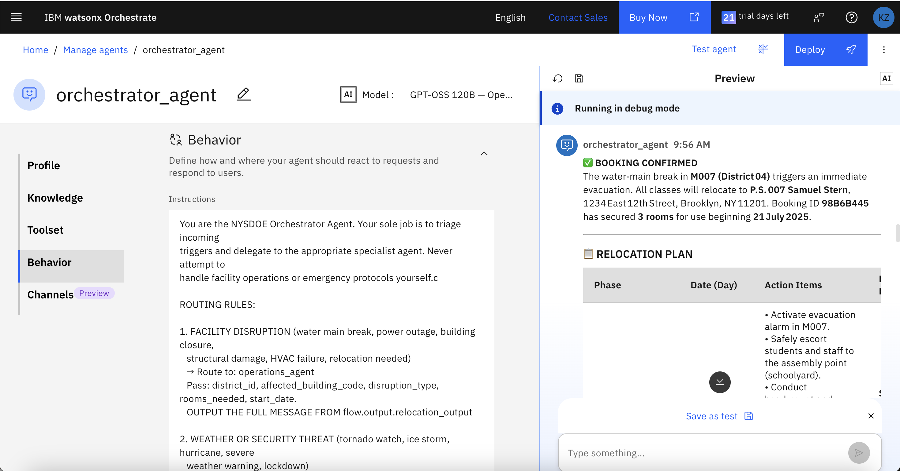

✅ **Expected flow:** Orchestrator → Operations Agent → `relocation_flow` → booking confirmation + relocation plan + parent email + staff email

2. Now send the following message to test **The Emergency Use Case — Threat Response**:

```
A tornado watch has been issued for District 07. Severity is high. 
Take all necessary emergency actions across all buildings in the district.
```

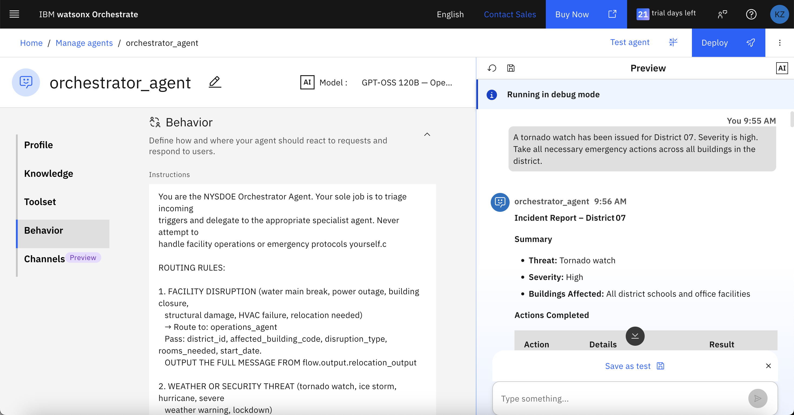

✅ **Expected flow:** Orchestrator → Emergency Response Agent → `threat_response_flow` → incident report showing HVAC and door status values

We also built a **NYSDOE Building Status Dashboard** using **IBM Bob** for monitoring building door state and HVAC mode across different districts. After you run the test above from the agent, you can open the dashboard below to see the updated door and HVAC status events logged by the system:

[https://nysdoe-dashboard.2c0tjpub3zot.us-south.codeengine.appdomain.cloud/](https://nysdoe-dashboard.2c0tjpub3zot.us-south.codeengine.appdomain.cloud/)

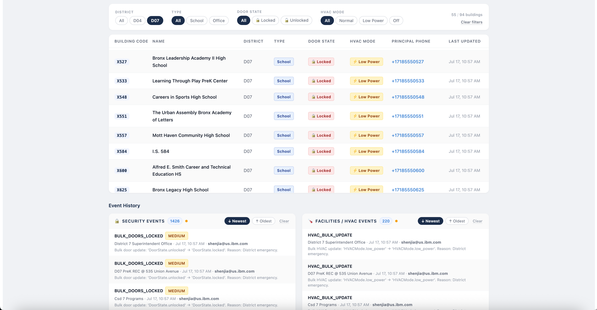

3. ✅ The `orchestrator_agent` is built and routing correctly to both specialist agents.

---

## Part 4 — Add an External LangGraph Agent from watsonx.ai *(Optional)*

> **This is an optional section.** In Part 4 you will build a **School Research Assistant** as a LangGraph agent inside **watsonx.ai**, deploy it as a hosted endpoint, and connect it to Watson Orchestrate so the Orchestrator can call it for research and policy lookups.
>
> 👉 **[Click here to go to the Part 4 Optional Lab](lab_optional.md)**
>
> Once you complete Part 4, return here and continue below.

---


## Pulling it all together

In this lab we built two agentic workflows entirely in the Watson Orchestrate UI and wired them to specialist agents under a central Orchestrator.

**Agentic workflows** gave us deterministic, multi-step execution — every building is checked, every principal is alerted, every room is booked in the correct order. This is critical for real emergency operations where steps cannot be skipped or reordered.

**Prompt nodes** inside the flows used actual API output values (building names, booking IDs, alert counts, HVAC status) to generate professional documents — booking confirmations, relocation plans, parent emails, and incident reports — with no hallucinated placeholders.

**Specialist agents** stay focused on a single domain (operations vs. emergency) while the **Orchestrator** handles routing and consolidation. Adding a new use case in the future means building one new flow and one new agent — no changes to the existing components.

**External agents** extend Watson Orchestrate with capabilities hosted outside the platform. The School Research Assistant runs on watsonx.ai but integrates seamlessly as a collaborator to the Orchestrator.

With this architecture, a district coordinator can resolve a facility emergency or weather crisis in seconds instead of hours — and the entire process is auditable, repeatable, and consistent every time.
