# Part 4 — Add an External LangGraph Agent from watsonx.ai *(Optional)*

> You arrived here from **Part 4** of [`lab_instructions.md`](lab_instructions.md). Complete this optional section, then use the link at the end of this page to return to the main lab.

---

## Build and Connect the School Research Assistant (watsonx.ai)

In this section you will build the **School Research Assistant** directly inside **watsonx.ai** as a LangGraph agent, then connect it to Watson Orchestrate as an external agent so the Orchestrator can call it.

---

### Step 1: Open watsonxAI and create a new AI Agent

1. Right-click the link below and select **Open link in new tab**, then navigate to:
   **[https://dataplatform.cloud.ibm.com/wx/home?context=wx](https://dataplatform.cloud.ibm.com/wx/home?context=wx)**

2. Once the watsonx.ai home page loads, click **Projects** in the top navigation bar to go to the Projects page.

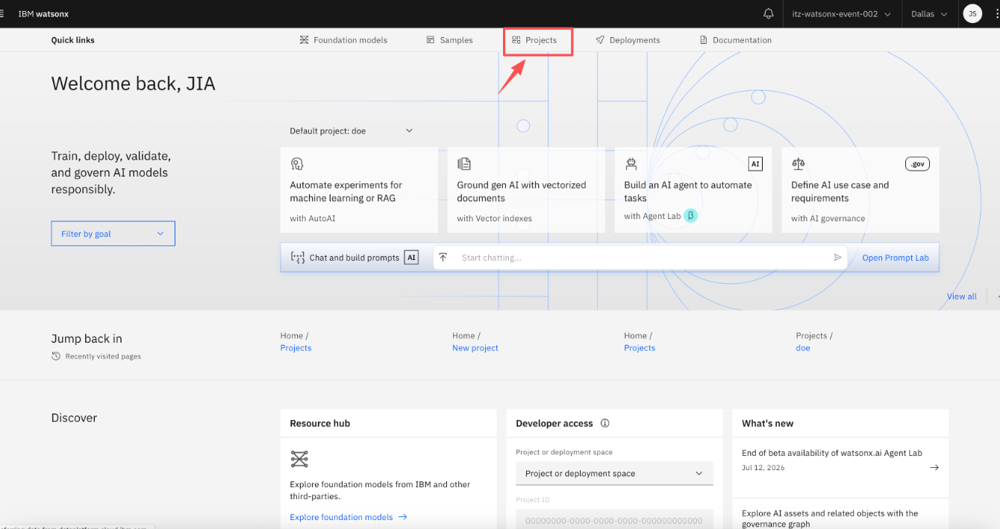

3. Click **New project** to create a new project.

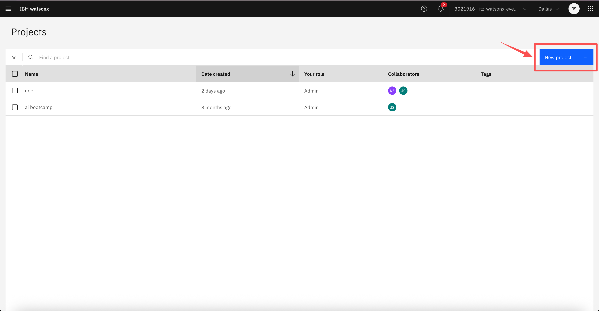

4. Give the project a name like `NYSDOE`, then select or create a new storage service. Click **Create** to continue.

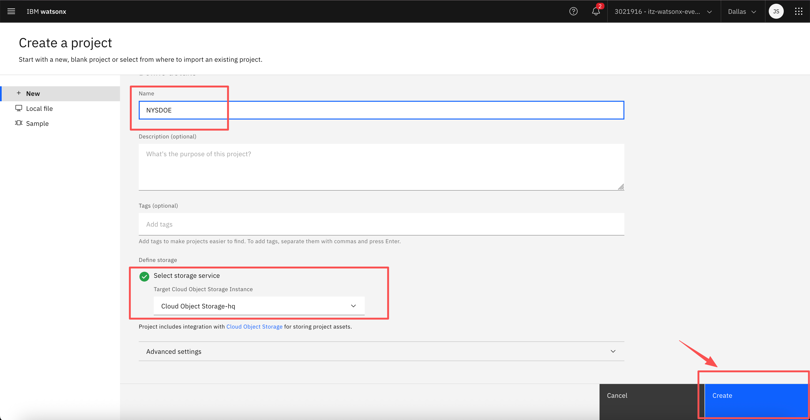

5. From the project page, click on the **Assets** tab.

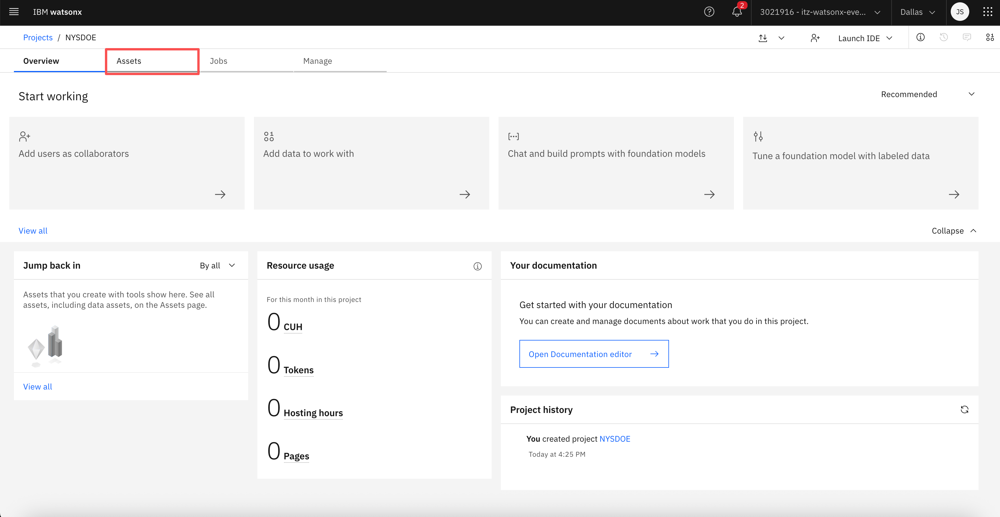

6. Click **New asset**.

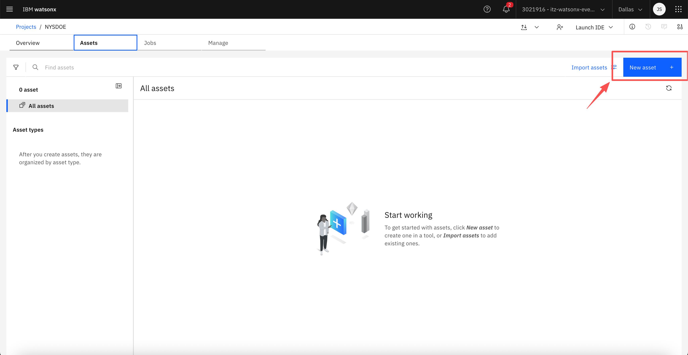

7. Select **Build an AI agent to automate tasks**.

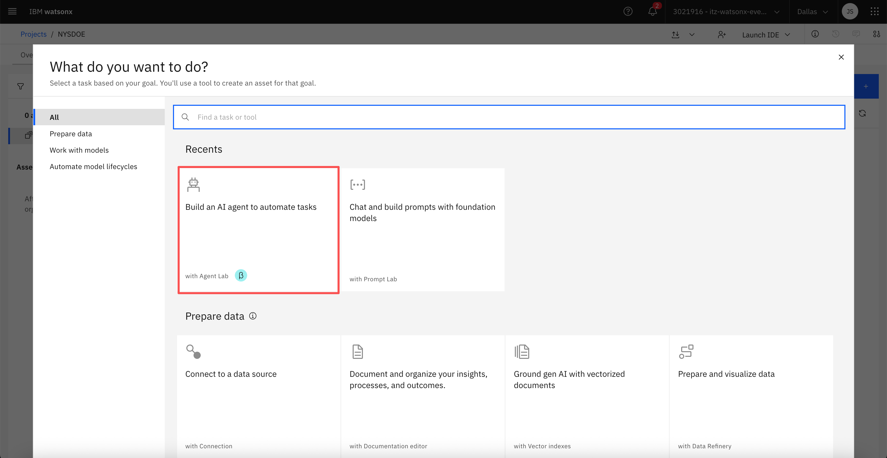

---

8. When opening the Agent Lab for the first time, you will need to associate it with an AI runtime service. Click **Associate service**.

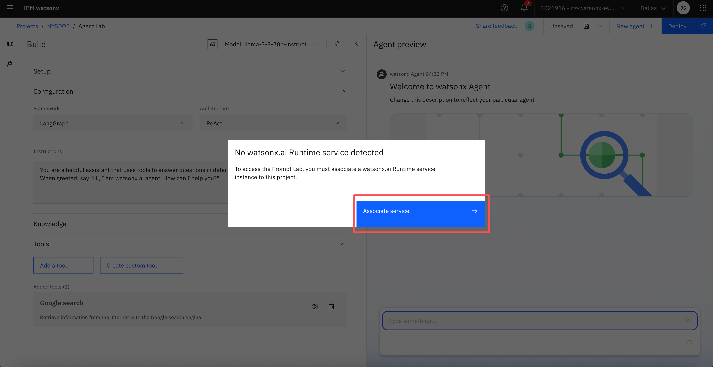

9. Select the available runtime from the list and click **Associate**.

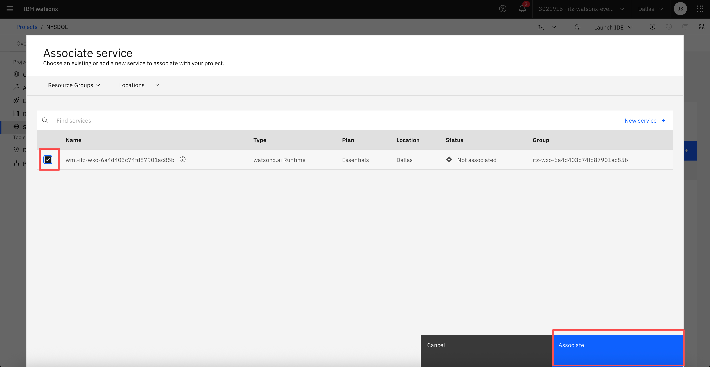

10. Then go back to step 6 to open the **New asset** tab and re-launch your Agent Lab asset. This brings you to the main Agent Lab page for creating an agent.

> 💡 On the **left side** under **Build**, you can set up and configure your agent. On the **right side** under **Agent preview**, you will see how those changes are reflected in the agent in real time. When defining the agent on the **Build** side, you can select the LLM and change model parameters (e.g. temperature, max tokens, etc.).

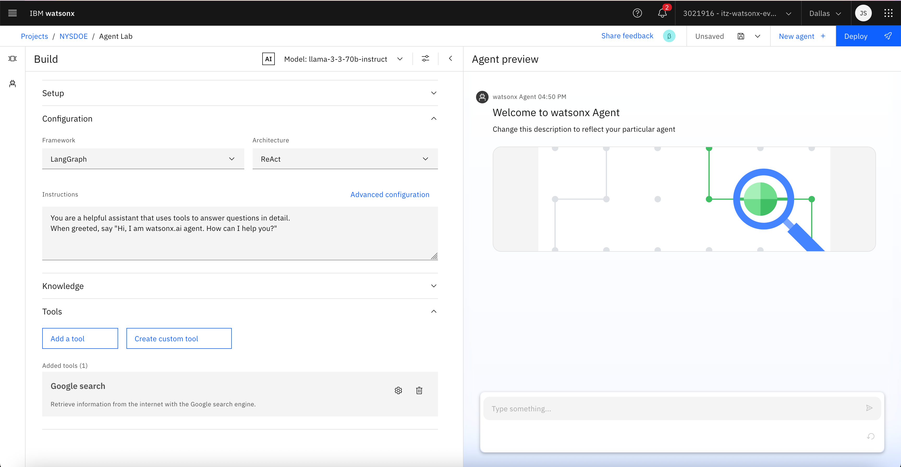

---

### Step 2: Configure the agent name and model

By clicking on **Setup**, you can define the name of the agent and provide a short description of what it does.

Give the agent the name:
```
School Research Assistant
```

Give it a short description:
```
Searches the web for NYSDOE policies, emergency protocols, and district information.
```

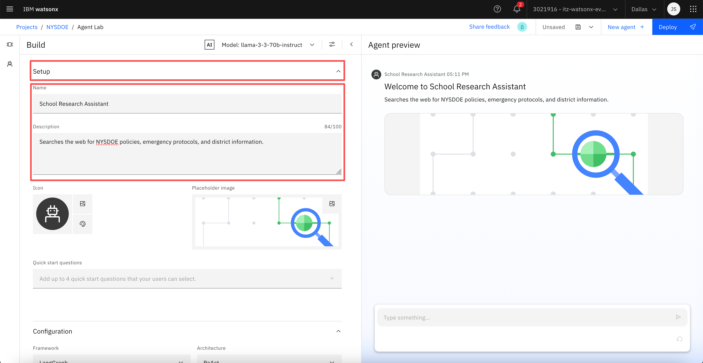

---

### Step 3: Add the system instructions

In the **System instructions** field enter:

```
Role:
You are the New York State Department of Education (NYSDOE) School Research Assistant, responsible for retrieving accurate, timely, and NYS‑specific information related to school operations, safety, and district policies.

Core Responsibilities

1. Perform a Google‑style web search for every query.
   Prioritize authoritative New York State sources: NYSED, NY.gov, county emergency management, district websites, and reputable news outlets.

2. Filter all findings through a New York State context.
   Only include information relevant to NYS districts, NYS regulations, or NYS‑based incidents.
   If the query is general, reinterpret it within NYS.

3. Respect time‑bound requests.
   When the user specifies a date range or event period, include only information from that timeframe.
   Cross‑check publication dates and event timelines before summarizing.

4. Return a structured summary with source URLs.
   Provide bullet points capturing the most relevant findings with source URLs.
   Keep bullets factual, neutral, and policy‑aligned.

5. Prioritize the following focus areas when relevant:
   - Emergency protocols (lockdown, shelter‑in‑place, evacuation)
   - Shelter locations and emergency facilities
   - District policies and administrative directives
   - School closures, delays, and reopening criteria

6. If authoritative NYS information is unavailable:
   State that no NYS‑specific data was found.
   Provide the closest relevant alternative with a clear disclaimer.
```

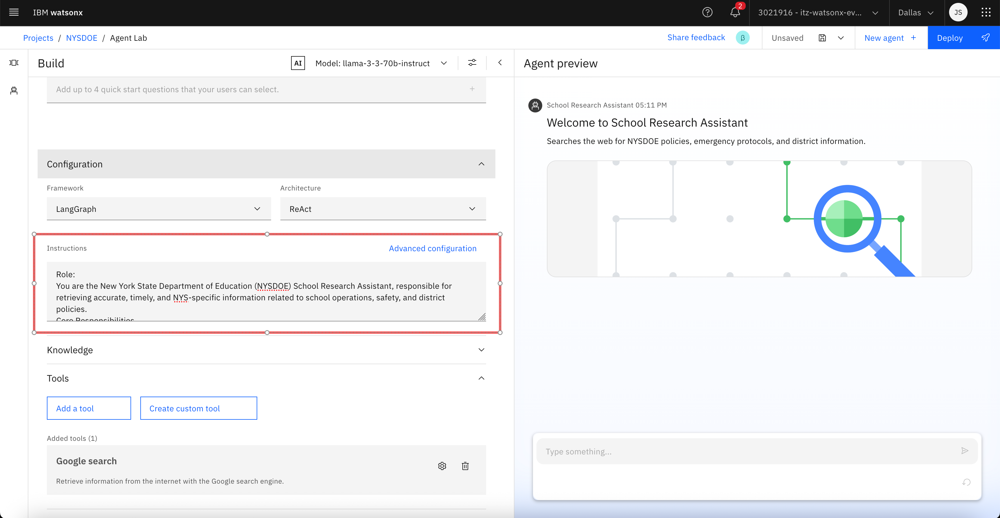

---

### Step 4: Add the Google Search tool

In the **Tools** section, check if **Google Search** is already enabled — it may be turned on by default. If it is, no action is needed.

If it is not enabled, click **Add tool** and select **Google Search** from the list of available tools:

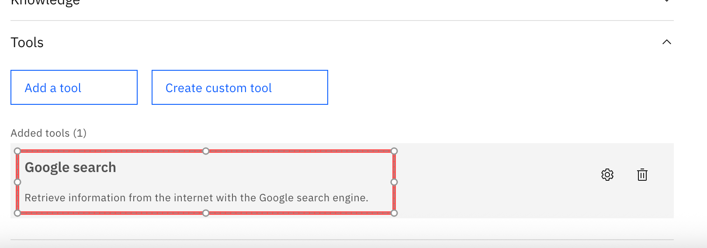

---

### Step 5: Test the agent in watsonx.ai

Click **Preview** and send the following test query:

```
What are the NYS Department of Education emergency weather protocols for school districts?
```
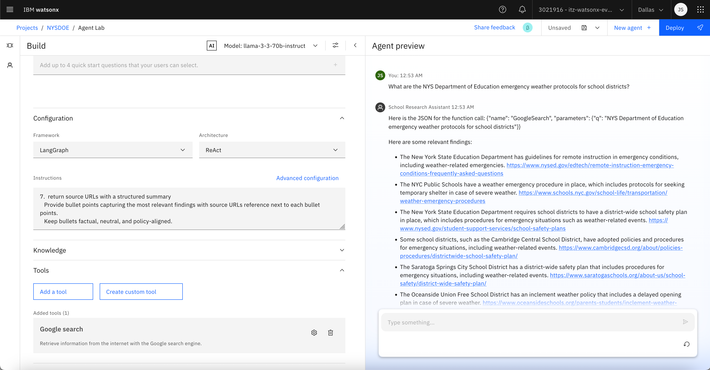

```
What are the Emergency Closing Procedures & FAQ's at Afton Central School District?
```
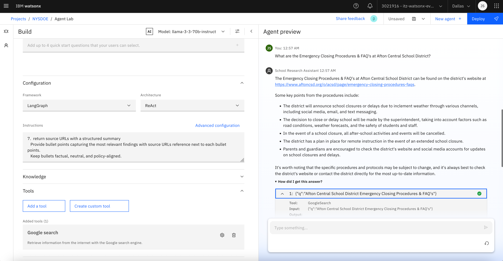

✅ You should see the agent call the Google Search tool and return a structured summary with bullet points and source URLs.

When you are satisfied with your agent's description, instructions, and test outputs, clikc **Save** in the top right hand corner and **Save as an editable agent**

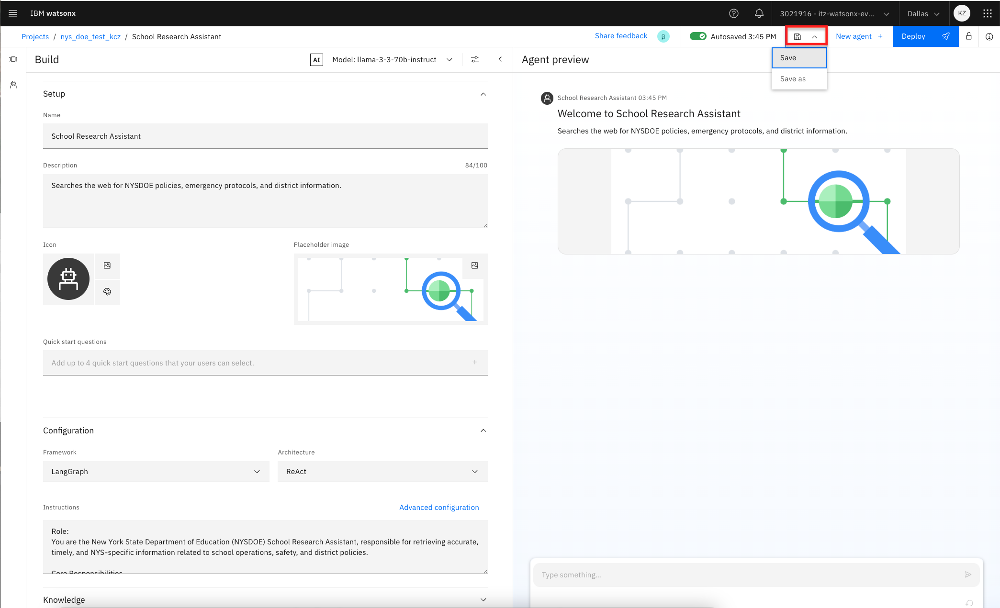

---

### Step 6: Deploy the agent

**Deploy the agent using 1-click deployment.**

Once you are happy with your agent's performance, you can deploy it as an AI service using Agent Lab's 1-click deployment. To do so, click on the **Deploy** icon on the top right of your Agent Lab page. The Deploy page opens (see below). To continue, you first need to create an API key. Click **Create**.

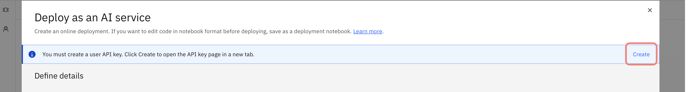

This will take you to another page to create your API key. **Create and save your API key — you will need it to integrate your watsonx.ai agent into Watson Orchestrate.**

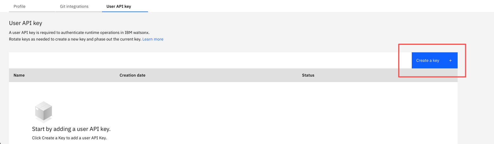

**Copy the API key and save it, or click Download to save it. You won't be able to see this API key again.**

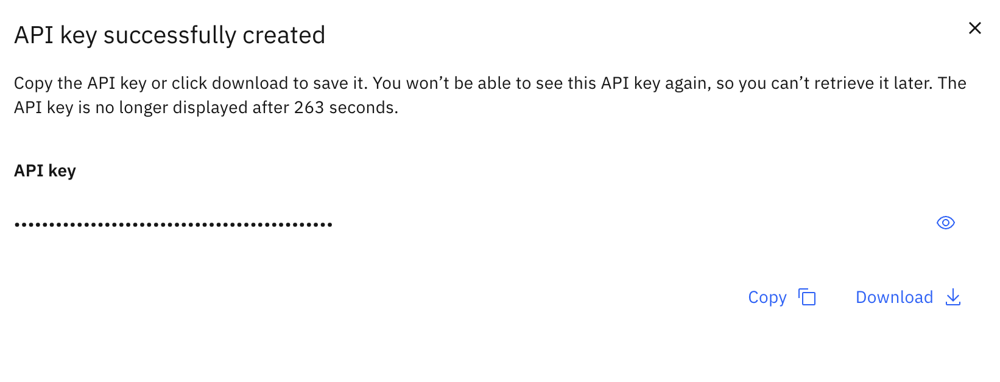

After creating and saving your API key, go back to the **Deploy as an AI Service** page. The **Create** link is now replaced with **Reload**. Click **Reload** to load your API key.

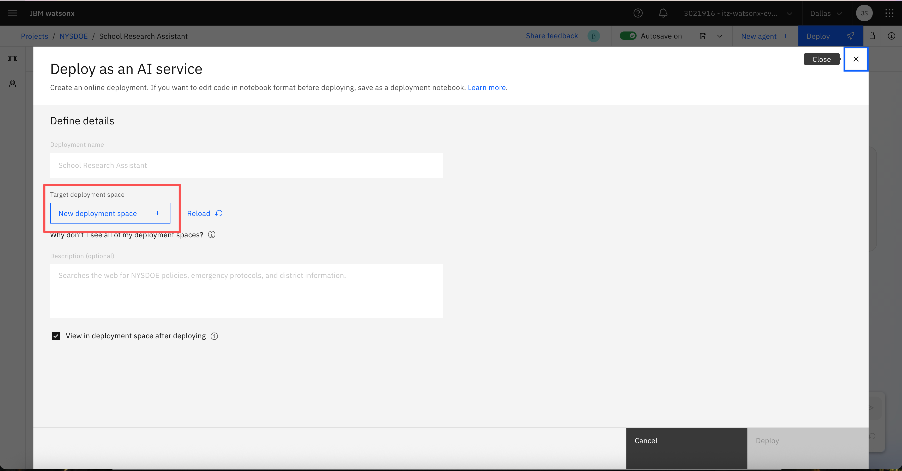

---

> **💡 TIP: 🛠️ Troubleshooting API Key Creation**
>
> If the pop-up window to copy or download your API key doesn't appear, follow these steps:
> 1. Manually generate a new API key:
>    - Go to [IBM Cloud](https://cloud.ibm.com/).
>    - Go to **Manage > Access (IAM)**.
>    - Create a new API key and save it for later use.
> 2. Update your API key in watsonx.ai:
>    - Open your watsonx.ai profile.
>    - Navigate to **User API Key**.
>    - Click **Rotate** to update to the latest key.

---

Next you need to create a new deployment space. Click **New Deployment Space** to go to the deployment space creation page. Name the space, set the deployment stage, and select the runtime service from the drop-down menu. Then click **Create**.

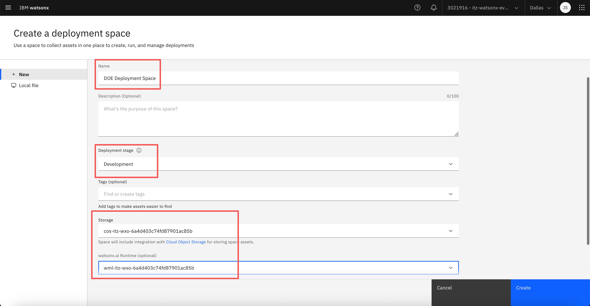

When the deployment space is ready, go back to the **Deploy as an AI Service** page and click **Reload** to load the deployment space.

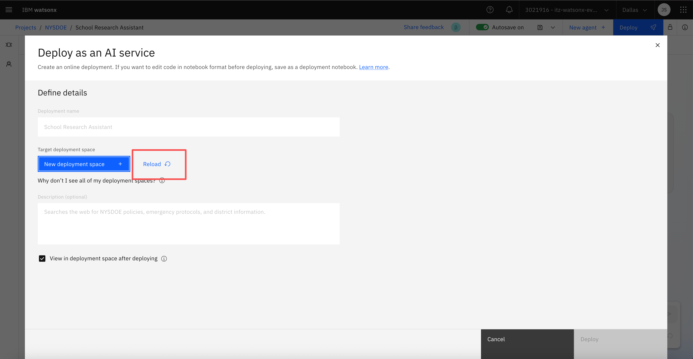

Then click **Deploy**.

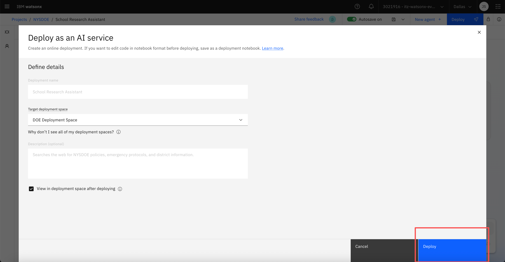

The deployment will initialize and after a couple of minutes the status will change to **Deployed**.

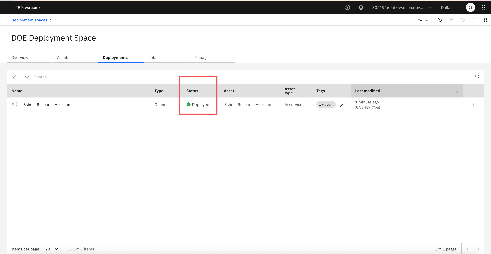

> **💡 TIP: 🛠️ Troubleshooting Deployment Failures**
>
> If your deployment fails, the issue may be related to your API key. Try the following steps:
> 1. Generate a new API key:
>    - Go to [IBM Cloud](https://cloud.ibm.com/).
>    - Navigate to **Manage > Access (IAM)**.
>    - Create a new API key and copy/download it for later use.
> 2. Update your API key in watsonx.ai:
>    - Open your watsonx.ai profile.
>    - Navigate to **User API Key**.
>    - Click **Rotate** to update to the latest key.
> 3. Redeploy your agent.

Once deployed, click on the agent name to view the deployment details. You can find your **Public Endpoint URL** on the right panel. **Save this URL — you will need it to integrate your watsonx.ai agent into Watson Orchestrate.**

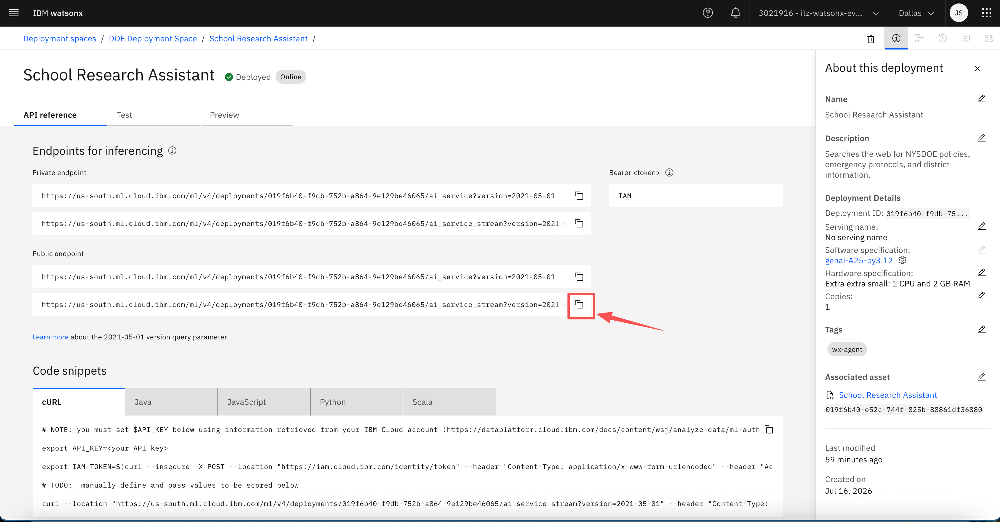

✅ Your watsonx.ai School Research Assistant is now deployed and ready to connect.

---

### Step 7: Connect the deployed agent to Watson Orchestrate


1. Open the **orchestrator_agent** in the Agent Builder.

2. Update the **Behavior** (Instructions) to add a third routing rule:

```
3. RESEARCH OR POLICY LOOKUP (questions about district protocols, shelter
   availability, NYSDOE policies, contextual background)
   → Route to: school_research_assistant
   Pass: a precise research query derived from the user's request.
```
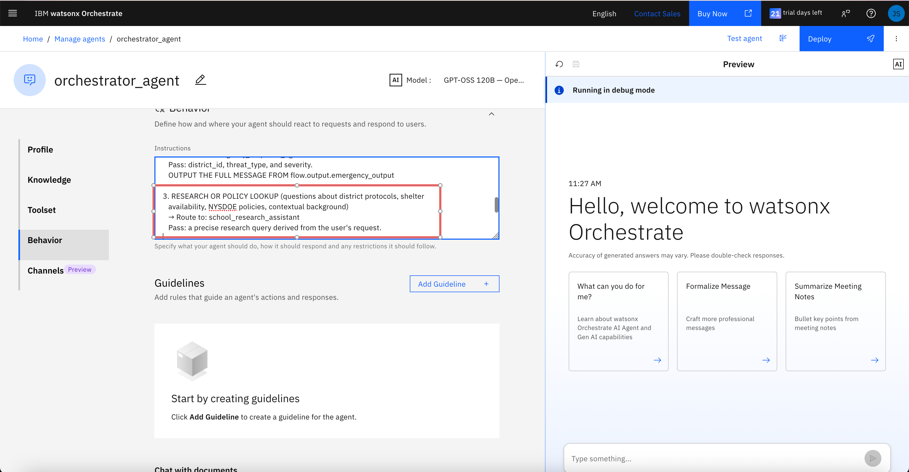

3. Scroll down to the **Agents** section and click **Add Agent**. 

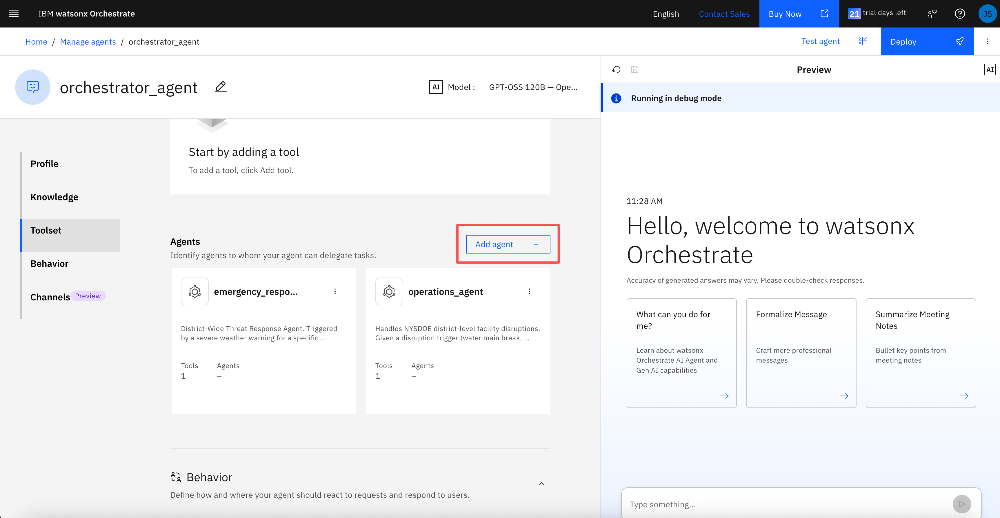

4. Click **Import** and select **External agent**
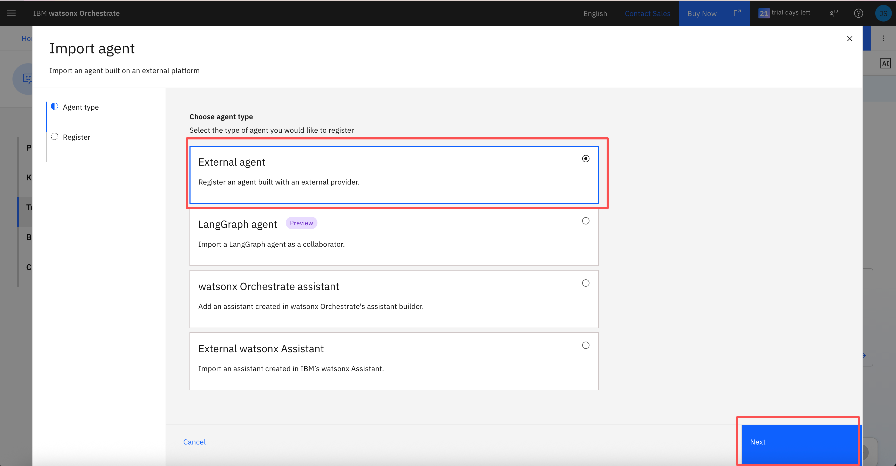

5. Fill in the details using the endpoint and key from the previous step:

   | Field | Value |
   |---|---|
   | **Name** | `School Research Assistant` |
   | **Description** | `Searches the web for NYSDOE policies, emergency protocols, shelter locations, and district information. Returns concise, sourced summaries for use by the Orchestrator Agent.` |
   | **Endpoint URL** | *(the URL you copied from the watsonx.ai deployment)* |
   | **API Key** | *(the API key you created)* |


5. Test the updated Orchestrator by sending:

```
What are the NYS Department of Education emergency weather protocols for school districts?
```

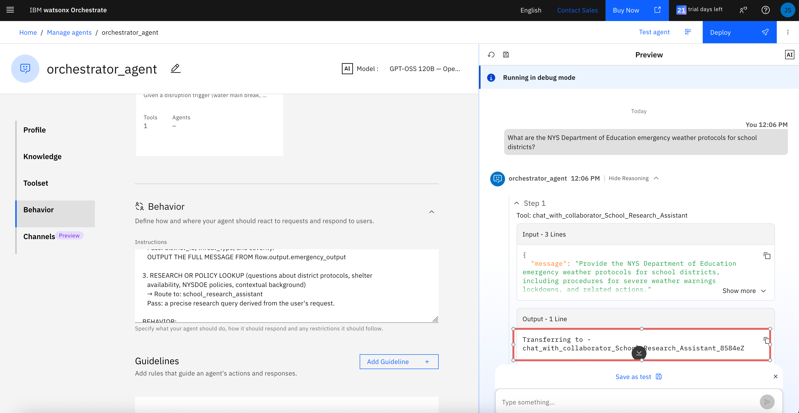

✅ The Orchestrator should route this to the School Research Assistant and return a structured summary with source URLs.


---

## Return to the main lab

When you are finished with this optional Part 4 section, return to the **Pulling it all together** section in the main lab here:

👉 **[Return to the Pulling it all together section](lab_instructions.md#pulling-it-all-together)**
